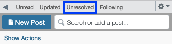

# CICS 110 Staff Guide
This is a guide for all-things staff for CICS 110. This page is rather long! I'd recommend using the section headers to navigate. Don't feel like you have to plow through it all in one sitting, since this serves a dual purpose as a guide and a manual (and therefore likely doesn't make for particularly fun reading `D:`).

## Communication and Organization
We use Discord for staff communication. If you need to be added to the discord, email `bburns@umass.edu`.
Every week, Ben will send out a message detailing all assignments due that week and any unfinished grading. Meeting notes will be sent in the Discord as well. 

We use Trello for course organization. This is mostly used for making sure slides and assignments are ready before we need them, status on graded items (grading, needs uploading, uploaded). We also use Trello for processing extension requests.

## Labs

## Office Hours
Your office hours should either be in-person or over zoom. On the office hours page, please include your 
- Name
- Day of week and time
- Room or zoom link

### Logging
In the Discord you'll find a channel named `#office-hours`. At some point in hour or two after you office hour, post a log to this channel that estimates how many students attended your office hour and what people asked about. An example log: 

> 12/4, 11am - 12pm.
> 4 students showed up to ask about Project 4. `Student A` and `Student B` did not know how to approach todos 3 and 6. `Student C` was having trouble getting the enumerate in the 5th todo to add items to the set correctly. 

An equally valid log is 

> 12/4, 11am - 12pm. No students attended my office hour.

This is 100% fine, and will probably be the case in the first couple weeks. It's better to log that no one showed up than it is to not log, don't feel pressured to say you had students when you didn't. This is for the instructors so they know if people are coming to office hours and what students are confused about. 

### Canceling Office Hours
If you have to cancel your office hour, you should immediately post a note to Piazza saying your office hour is canceled. Then post to the `#office-hours` channel. If you miss your office hour, you can post a note to Piazza if you like, but you should post about it in the Discord channel. 

It's fine if you miss an office hour, just make sure you're honest and up front about it, because otherwise it might look like you're skipping.

## Piazza
Each UCA and TA has a day on which you are expected to monitor Piazza. You aren't expected to be monitoring at all times, you're just supposed to be paying extra attention that one day. For me, this means turning on `Push Notifications` on the mobile app, which I can definitely recommend, but do what ever works best for you. 

### Responsibilities
You should spend up to an hour answering questions that day. If there aren't any new questions posted on your day, go back through the Unresolved section.

This will show all posts that have no student or instructor responses yet, and any posts with unresolved follow ups. Try to sift through these. Most are usually already answered by another post, outdated (e.g. asking about an assignment whose deadline has now passed), are resolved but marked unresolved, or a logistical question UCAs and TAs don't have an answer to.

### Ask for help!
If there is a question that you can't answer, but an Instructor can, `@` all instructors or a specific instructor in Discord, and include a link to the post. 
The best example of posts in this category are things like "what's on the next exam?" or "when's project/challenge X being posted?"

If questions are coming in faster than the assigned staff can handle, like before a major deadline or exam, don't be afraid to `@` all UCAs asking if anyone is free to help out.

## Grading
 
## Uploading to Moonami
### zyBooks
### Gradescope

## Exams
A detailed break down of exam structure can be found in the [Guide to Exams](./exams).

### Before the Exam
A Google sheet needs to be created for check out. There should be subsheet for each section with all student names and emails imported. The sheet should look something like:

| First Name | Last Name | Student Email | Staff initial |
| --- | --- | --- |--- |
| John | Doe | jdoe@umass.edu | | 
| J. Random | Hacker | jrhacker@umass.edu | BB |
|...|...|...|...|

The night before the exam, at least two UCAs should proof read the questions and report any typos or questions they find confusing. A guide of how to do this is [here](#proof-reading-and-reporting-typos)

A staff member should get to the lab 15-20 minutes early to straighten out desks so that no two students are sitting too close.
If possible, students should not sit in the back row. If it is necessary, pull the desks forward so that staff can freely walk behind the back row.

### During the Exam
During the exam, there are three main jobs we have 
- Answering student questions
- Checking students out once they finish
- Monitoring for academic honesty violations

At least one staff member should be at the back watching students' screens, monitoring for academic honesty violations. Another staff member should be at the front ready to check out students as they finish. Any other staff are free to walk around asking questions, or stand at the back of the room.

### Student check out
The staff member in charge of check out should have the check-out sheet open, as well as the exam responses page open. You can find the latter by going to Moodle, then the exam page, then clicking the cog on the right, and selecting `Responses`.

The process for checking out a student is as follows
1. Ask for the student's uCard
2. Look the student up in `Responses` and verify the student has submitted
3. Find the student in the check out sheet, and put your initials next to their email. 
4. Return their uCard and tell them they're free to leave

Step 1 is so we know they're who they say they are. Step 2 is to make sure they submitted, otherwise they can leave the exam, reopen their laptop, and keep working. Step 3 is to make sure the student actually attended the lab to take the exam.

### Proof Reading and Reporting Typos
To proof read the exam, go to the Exam on Moodle, click the cog on the right, and select `Edit quiz`. On each question you will a field that says `(See questions)`, which you should open (it's way easier if you open it in a new tab). Then click the `Edit` dropdown, and select `Preview` (again, easier in a new tab).

If you find a typo in a question, or find the wording confusing or ambiguous, @ the instructor who last edited the question in Discord, including the question number, the name of the version, and the typo you found/what you found confusing. Unless specified otherwise, only Instructors should be editing exam questions directly. 