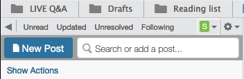
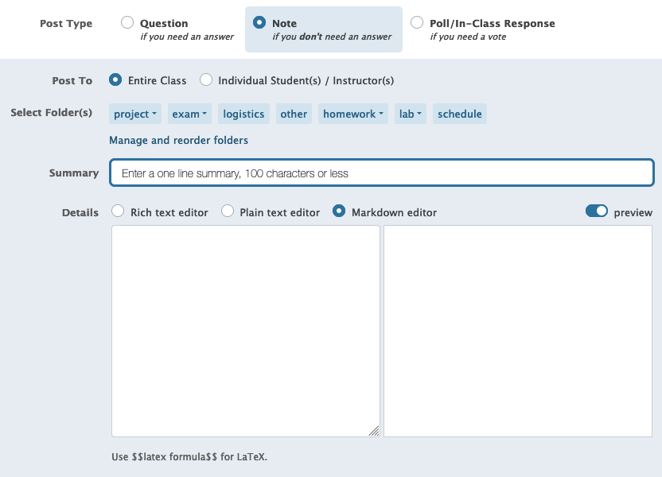

# How to use Piazza

## Using Piazza
To ask a question, click the `New Post` button in the top left corner:

You'll then be presented with the following screen:

99% of the time you'll want to pick `Question`. 
Public posts are `Entire Class`, private posts are `Individual Student(s)/Instructor(s)`. 
If you pick the latter, typing `Instructors` posts to the entire staff. 
You can also post to just your instructor if you need to, put we're prefer you reserve this for personal matters.

Then select a folder based on what your question is about, type up your question. 

Before you select `Post My Question/Note`, you can chose if you want your question to have your name shown, or be anonymous to classmates. 
It's up to you, but I know from personal experience it's much easier to ask questions anonymously.
## How to ask for Help
There are three main types of questions
1. Approach-based questions: How do I start Todo 4 in the project? 
2. Code-specific questions: Why is my code not working how I want it?
3. Logistical questions

Piazza is great for approach-based questions. 
We highly recommend that you make these posts public. 
That way other students can see the questions, as well as discuss them or even answer them. 
If you are shy about asking your classmates for help, you can always post anonymous! 
Posting publicly is also a huge help to us, since it prevents us from asking the same question over and over again.

For more on code-specific questions, see the [Posting Code](#posting-code) section.

For logistical questions, you can either post public or private. 
It's up to your discretion based on the question you want to ask. 
## Posting Code
A classic question that we see every semester is 
> Why is this not working? 

with an image of someone's source code attached. 
This is an academic honesty violation, and is also usually hard for us to answer without just giving you the solution.

Firstly, **do not ever include your source code for an assignment in a public Piazza post.**
Posting your code to the entire class is code sharing, and is therefore an academic dishonesty violation per the academic honesty policy detailed in the syllabus.
We take this very seriously, so please do not do it.

Instead,
1. If you have a question about zyBooks or zyLabs, please make a public post directing us to the specific section and question. We can see your submissions, and will respond to your post either with general pointers, or even with what you should look to change.

> Example: 
> I've been stuck on section 2.15 of the lab. Can you give me some pointers?

2. If you have a question about an assignment, please first submit your current code to Gradescope. Then, ask your question and include a link to your Gradescope submission at the bottom.

> Example: 
> I am stuck on Todo 4, specifically the part with getting the print formatting right. Any advice? 
> 
> Gradescope link: `link to submission`

3. Lecture code and code in the homework exercises are fine to be posted. In fact, we encourage you as students to try to respond to these! Just make sure you err on the side of leading the student in the right direction. Do not give them the answer directly (again, academic honesty is important to us).