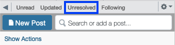

# CICS 110 Staff Guide
This is a guide for all-things staff for CICS 110. This page is rather long! I'd recommend using the section headers to navigate. Don't feel like you have to plow through it all in one sitting, since this serves a dual purpose as a guide and a manual (and therefore likely doesn't make for particularly fun reading `D:`).

## Communication and Organization
If you need to be added to the staff chat, email `bburns@umass.edu`.
Every week, Ben will send out a message detailing all assignments due that week and any unfinished grading to `#logistics`
Meeting notes will be sent in `#logistics` as well. 

We have a Trello board for course organization. This is mostly used for making sure slides and assignments are ready before we need them, status on graded items (grading, needs uploading, uploaded). You do not need to check the Trello, as it's mostly for my (Ben's) use in keeping us organized. However, you should be able it, and it will let you can see, at a glance, the status of everything in the course. 

## Labs
Labs are hosted every Friday. Each UCA and half TA attends 1 lab per week, and each full TA attends 2 labs. Staff assignments can be found on the [Labs course information page](../../information/labs). The labs themselves are hosted in the [Labs directory](../../labs).

Each lab will have its own instructions on what is expected of students. Typically students will be working in groups. Your job as staff is to be actively trying to help students. Some students will really want help, but are too embarrassed or intimidated to ask. 

That being said, some students will not want help. Trying to force help on a student who doesn't want it can make it more difficult for them to work, and potentially make them less likely to ask for help in the future when they do need help. Even if they're doing something incorrectly just let them figure it out, maybe they ask for help at a later point.

Learn students' names! This is the place they get to know you and really get familiar with the course staff. 

## Office Hours
Your office hours should either be in-person or over zoom. 
On the office hours page, please include your 
- Name
- Day of week and time
- Room or zoom link

### Logging
In the staff chat you'll find a channel named `#office-hours`. 
At some point in hour or two after you office hour, post a log to this channel that estimates how many students attended your office hour and what people asked about. 
An example log: 

> 12/4, 11am - 12pm.
> 4 students showed up to ask about Project 4. `Student A` and `Student B` did not know how to approach todos 3 and 6. `Student C` was having trouble getting the enumerate in the 5th todo to add items to the set correctly. 

An equally valid log is 

> 12/4, 11am - 12pm. No students attended my office hour.

This is 100% fine, and will probably be the case in the first couple weeks. 
It's better to log that no one showed up than it is to not log, don't feel pressured to say you had students when you didn't. 
This is for the instructors so they know if people are coming to office hours and what students are confused about. 

### Canceling Office Hours
If you have to cancel your office hour, you should immediately post a note to Piazza saying your office hour is canceled. 
Then post to the `#office-hours` channel. 
If you miss your office hour, you should post about it in `#office-hours` as well, and make a Piazza post acknowledging that you missed your office hour. 

It's fine if you miss an office hour, just make sure you're honest and up front about it, because otherwise it might look like you're skipping.

## Piazza
Each UCA and TA has a day on which you are expected to monitor Piazza. You aren't expected to be monitoring at all times, you're just supposed to be paying extra attention that one day. For me, this means turning on `Push Notifications` on the mobile app, which I can definitely recommend, but do what ever works best for you. 

### Responsibilities
You should spend up to an hour answering questions that day. If there aren't any new questions posted on your day, go back through the Unresolved section.

This will show all posts that have no student or instructor responses yet, and any posts with unresolved follow ups. Try to sift through these. Most are usually already answered by another post, outdated (e.g. asking about an assignment whose deadline has now passed), are resolved but marked unresolved, or a logistical question UCAs and TAs don't have an answer to.

### Ask for help!
If there is a question that you can't answer, but an Instructor can, `@` all instructors or a specific instructor in `#general`, and include a link to the post. 
The best example of posts in this category are things like "what's on the next exam?" or "when's project/challenge X being posted?"

If questions are coming in faster than the assigned staff can handle, like before a major deadline or exam, don't be afraid to `@` all UCAs asking if anyone is free to help out.

## Grading
Grading is all done via Gradescope. Most, if not all assignments in this course are autograded. For a guide on how to manual grade (at the high level, how to design a rubric, and how to use Gradescope itself), 
see [this guide](https://groups.cs.umass.edu/uca/uca-training-grading-on-gradescope/) on the UCA website. 

## Uploading to Moonami
### zyBooks
:::note
Until future notice, this course has no grades in zyBooks, so this section will be expanded as needed
:::
### Gradescope

## Exams
A detailed break down of exam structure can be found in the [Guide to Exams](../exams).

:::note
In Spring 2023, CICS 110 plans to have no exams. However, this guide will remain for future semesters. 
:::

### Before the Exam
A Google sheet needs to be created for check out. There should be subsheet for each section with all student names and emails imported. The sheet should look something like:

| First Name | Last Name | Student Email | Staff initial |
| --- | --- | --- |--- |
| John | Doe | jdoe@umass.edu | | 
| J. Random | Hacker | jrhacker@umass.edu | BB |
|...|...|...|...|

The night before the exam, at least two UCAs should proof read the questions and report any typos or questions they find confusing. A guide of how to do this is [here](#proof-reading-and-reporting-typos)

A staff member should get to the lab 15-20 minutes early to straighten out desks so that no two students are sitting too close.
If possible, students should not sit in the back row. If it is necessary, pull the desks forward so that staff can freely walk behind the back row.

### During the Exam
During the exam, there are three main jobs we have 
- Answering student questions
- Checking students out once they finish
- Monitoring for academic honesty violations

At least one staff member should be at the back watching students' screens, monitoring for academic honesty violations. Another staff member should be at the front ready to check out students as they finish. Any other staff are free to walk around asking questions, or stand at the back of the room.

### Student check out
The staff member in charge of check out should have the check-out sheet open, as well as the exam responses page open. You can find the latter by going to Moodle, then the exam page, then clicking the cog on the right, and selecting `Responses`.

The process for checking out a student is as follows
1. Ask for the student's uCard
2. Look the student up in `Responses` and verify the student has submitted
3. Find the student in the check out sheet, and put your initials next to their email. 
4. Return their uCard and tell them they're free to leave

Step 1 is so we know they're who they say they are. Step 2 is to make sure they submitted, otherwise they can leave the exam, reopen their laptop, and keep working. Step 3 is to make sure the student actually attended the lab to take the exam.

### Proof Reading and Reporting Typos
To proof read the exam, go to the Exam on Moodle, click the cog on the right, and select `Edit quiz`. On each question you will a field that says `(See questions)`, which you should open (it's way easier if you open it in a new tab). Then click the `Edit` dropdown, and select `Preview` (again, easier in a new tab).

If you find a typo in a question, or find the wording confusing or ambiguous, `@` the instructor who last edited the question, including the question number, the name of the version, and the typo you found/what you found confusing. Unless specified otherwise, only Instructors should be editing exam questions directly. 

## Responsibilities
### UCAs
All UCAs are going to have 3.5 out of their 5 hours "fixed": this is time reserved for labs, piazza, office hours, and meetings. The other hour and a half are sort of "up to the UCA" as to what we're expecting from you. Filling everyone's hours with tasks doesn't give us much room for flexibility, nor is it particularly engaging. It's not a good model for adapting to the challenges of various weeks.

This is also a responsibility for you as a UCA to try new things. Figure out what the course needs, what students need, or even what you struggle with as a UCA and want to improve on.

A guideline for UCA responsibilities is:
- 1 hour of attending lab
- 1 hour of hosting an office hour
- 1 hour of monitoring Piazza, spread throughout a single day each week
- 30 minutes of attending a weekly all-UCA meeting
- 1 hour 30 minutes of flexible responsibilities, which can include
  - attending a lecture
  - proofreading slides, homework, or quizzes
  - answering Piazza on busy days you aren't assigned to
  - helping fix autograders
  - reviewing similarity results for homeworks submitted to Gradescope

If you're every feeling underutilized or unhappy about your responsibilities, ping Ben and I'll help you rework your responsibilities. 

### TAs
The TA responsibilities are a little less fun. For half TAs, you have 5 hours of fixed responsibilities between labs, office hours, piazza, and meetings. Full TAs have the same thing, but with 2 hours of labs, giving 6 hours of fixed responsibilities. 

In addition, each TA will be required to complete the weekly homework and weekly lab. This is not to give you busy work or to test your abilities, it's so that we have at least four people each week reading through the documentation looking for confusing instructions or explanations, finding problems with the autograder, and who are very familiar with what we are asking from our students. 

The hope is that each of these takes at most an hour. You should shoot to have a submission to the autograder by 5pm EST the day before the assignment is due. 

A guideline for TA responsibilities is:
- 1 or 2 hours of attending lab
- 2 hours of hosting an office hour
- 1 hour of monitoring Piazza, spread throughout a single day each week
- 1 hour of attending a weekly meeting
- Up to 2 hours of proofreading labs and homeworks
