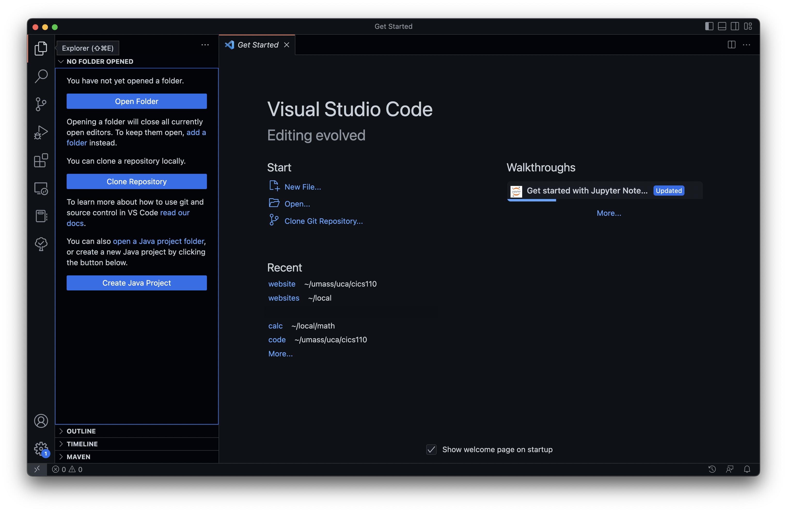
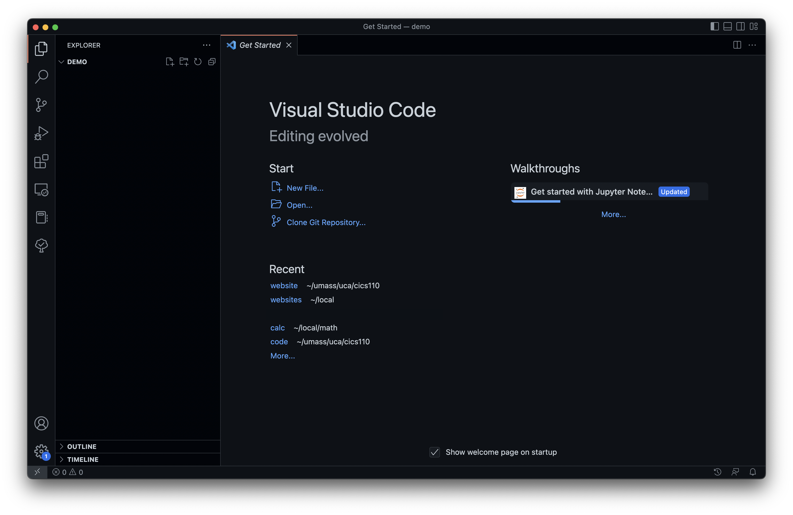
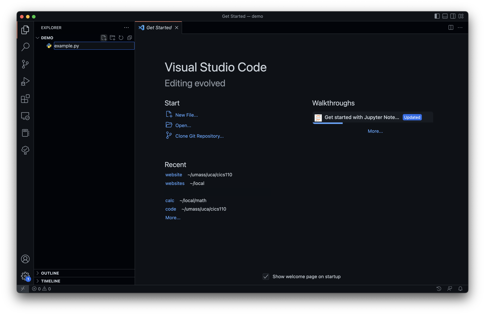

# Installation and Setup
In this course, we will be using VSCode as our editor.

## Installing VSCode
To install VSCode, visit the [VSCode website](https://code.visualstudio.com/). The webpage should detect your operating system, and the button will be the version of VSCode for your OS. Click download, run the installer, and install VSCode. 

## VSCode Interface
Once you install VSCode, you should open the application. The interface presents you with a lot, but there's a lot of stuff we can ignore for now. There is an in-depth tutorial on the VSCode interface on the [VSCode website](https://code.visualstudio.com/docs/getstarted/userinterface), but it is a little outdated and doesn't focus on the features we will be using. 

Once you launch VSCode, you'll see a window similar to the following image:

On the left edge of the image, you'll see the sidebar icons. Reading down from the top, we have the
1. File explorer
2. Search
3. Version control (ignore for now)
4. Debugger
5. Extensions

The icons after the "Tetris block" Extensions icon are all icons for extensions I have installed. The ones useful for this course will be detailed in the [extensions guide](../extensions), but we can ignore these for now.

## Opening a folder
To use VSCode to edit code, we need to open files. When writing code for a homework or project, the best practice is often to have all your files for that project in a single folder on your computer. That way, all your files are in one place for easy access, and we can just open the folder in VSCode to edit the code, rather than opening each file individually.

To open a folder, select the file explorer icon in the top left. Then click "Open Folder". 

Alternatively, you can press ⌘+O on Mac (that is, press the command key and the "O" key at the same time, O for open), or Ctrl+K, Ctrl+O on Windows (just pressing Ctrl+O only lets you open single files, not folders). This will open your computer's file manager. In this window, you should navigate to either a.) an existing folder that either contains the code your want to edit, or is where you want to put new code, or b.) navigate to where you want to create a new folder. 

For example, let's say I want to make a new project. I want to open a folder called `demo`. On my Mac, I would press ⌘+O, then navigate through my files to `umass > cics110 > code > demo`, and select open in the bottom right. 

## Creating a new Python file
Now that we have an empty folder open, we want to create a Python file to write code in. In the top left, there is a new file button, highlighted below (the first icon to the right of `Demo`):

If we click the new file button, VSCode will create a file, and let us type in a file name. It is important that your file name ends in `.py`, so your computer knows it's a python file. For example, I name my file `example.py`:

## Installing Python Extensions
We have an empty Python file, and are able to start coding. However, VSCode has some extensions that will make our job easier. When you open a Python file for the first time, you should get a pop up in the bottom right informing you of Python extensions in the VSCode marketplace, which you should click. If not, click the Extension icon (Tetris blocks) on the left sidebar. Then enter "Python" in the search bar. The first result should be the [Python extension](https://marketplace.visualstudio.com/items?itemName=ms-python.python), which you should install:

This extension gives you everything you need to start coding. It includes features like
1. Syntax highlighting - colors your source code to make it easier to read what is a variable, what is a function, etc.
2. A Python linter - a program that detects some errors, like typos, undeclared variables, or incorrect indentation, without you having to run the program
3. A Python debugger - a powerful program that lets you step run your Python program line-by-line, and view the values of all your variables at any point in the execution. 

This is a minimal install just to get you everything you need to succeed in the course. However, there are some other (optional) extensions you may find helpful, like different color themes or TODO highlighting, which we detail in the next guide.