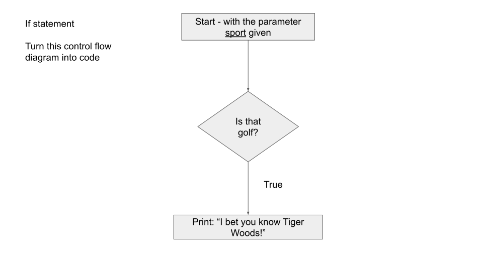
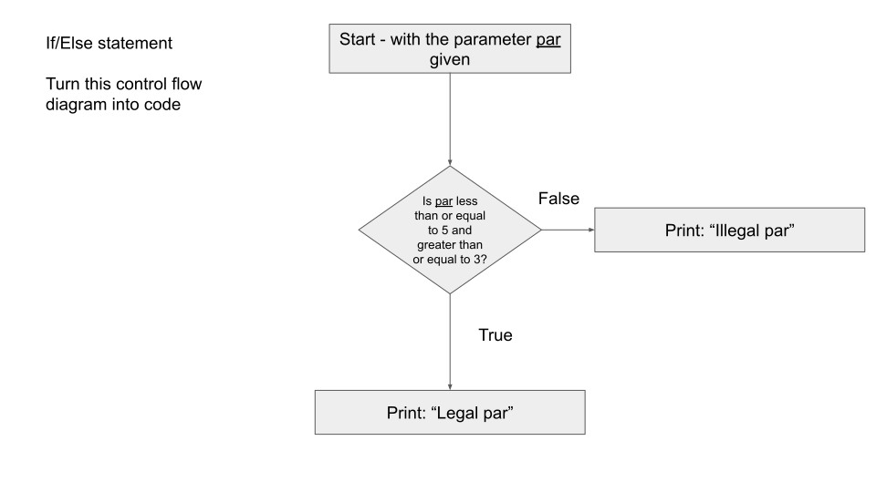
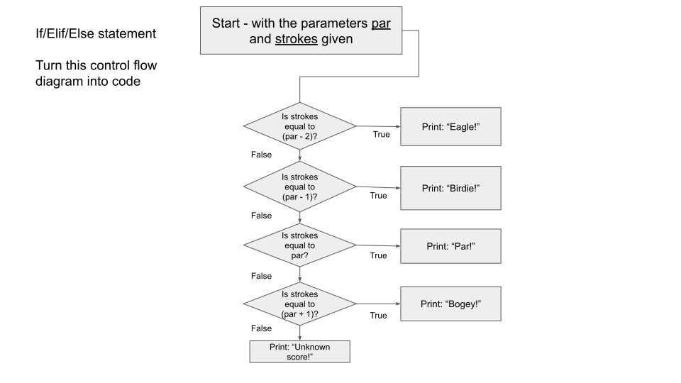

# Lab 05: Branching Diagrams

## General Information

<details>
<summary><b>Submitting to the Auto-Grader</b></summary>

For auto-grading homework assignments in the course,
we use [Gradescope](https://www.gradescope.com).

#### General Submission Info

When submitting files to Gradescope,
you need to submit all the files you want graded at once.

You can do this in several ways:
* Select all files you want to submit and drag and drop them in the submission area when prompted.
* Browse your files when prompted by Gradescope and select all files you want to submit.
* Directly compress all the files you want to submit into a zip file (zip file name does not matter),
and submit that zip file via drag-and-drop or browsing for it.
* Compress a folder containing the files you want to submit into a zip file (zip file name does not matter),
and submit that zip file via drag-and-drop or browsing for it.

Gradescope will look for files with specific names, and those names are case-sensitive.
So if in the instructions we ask for a file named `hello.py`,
then Gradescope will not recognize `Hello.py`, `hello.txt`, or `hello.py.txt`.

#### Group Submissions

When a group of people is submitting an assignment,
only one person should submit the solution.

They should then add the other members to that submission.
On the Gradescope page for a submission there should be a
"+ Add Group Member" button by the name in the upper-right.

This is important because if multiple people submit,
our similarity checker will see identical submissions and flag that.

#### Unlimited attempts

You have unlimited attempts for our auto-graded assignments.

This means that you should submit early and often in order
to be confident that code you are writing as you go passes all of our tests.

</details>

<details>
<summary><b>Academic Honesty</b></summary>

All work that is completed in this assignment is your own group's.
You may talk to other students about the problems you are to solve,
however, you may not share code in any way, except with your partner(s). 
What you submit **must be your own group's work**.

You may not use any code that is posted on the internet. If you are
not sure it is in your best interest to contact the course staff.
We will be using software that will compare your code to other students in the course
as well as online resources.
It is very easy for us to detect similar submissions and will result in
a failure for the exercise or possibly a failure for the course.
Please, do not do this.
It is important to be academically honest and submit your work only.
Please review the [UMass Academic Honesty Policy and
Procedures](https://www.umass.edu/honesty/) so you are aware of what this means.

Copying partial or whole solutions, obtained from other students or elsewhere, is academic dishonesty.
Do not share your code with your classmates, and do not use your classmates' code.
If you are confused about what constitutes academic dishonesty you should re-read the course policies.
We assume you have read the course policies in detail and
by submitting this project you have provided your virtual signature in agreement with these policies.

</details>

## About

This lab has you writing conditional statements and practicing transforming control flow diagrams into code.

This lab has you use `if`, `if`/`else`, `if`/`elif`/`else` to create logic flows and allow your codes to make choices.

### Learning Objectives

1. Practice writing `if`, `if`/`else`, `if`/`elif`/`else`
2. Practice understanding and transforming control flow diagrams into codes

### Estimated Size

3 functions:
* Two lines of code
* Four lines of code
* Ten lines of code

## Preamble

### `if`/`elif`/`else`

This lab centers around control flow diagrams and conditional statements such as `if`, `if`/`else`, `if`/`elif`/`else`.

For instance:
```py live_py title=If
weather = input("What is the weather today: ")

equipment = ["coat", "hat"]

if weather == "rain": # if it is raining
    equipment.append("umbrella") # I will grab an umbrella

print(equipment)
```

If the `weather` variable has the value `"rain"` in the above example, then the program will add the string `"umbrella"` into the Python list named `equipment`.

Building on this, we can make more advanced decisions using `if`/`else`.

For instance:
```py live_py title=If_Else
weather = input("What is the weather today: ")

equipment = ["coat", "hat"]

if weather == "rain": # if it is raining
    equipment.append("umbrella") # I will grab an umbrella
else:
    print("Spring break is coming!")

print(equipment)
```

This time we see that if the `weather` variable has a value other than `"rain"`, we will do something different - in this case, print something out.

Similarly, we can also check for multiple conditions in a row (as opposed to just one condition) using `if`/`elif`/`else`. Let's see an example:

```py live_py title=If_Elif_Else
input_month = input()
input_day = int(input())

if (input_month == "March"):
    if (input_day > 0 and input_day <= 19):
        print('Winter')
    elif (input_day > 19 and input_day <= 31):
        print('Spring is here!')
    else:
        print('Invalid')
```
Based on the variable `input_month`:
* If it is March:
  * We will check if `input_day` is between 0 and 19. If it is, we know we are still in the Winter.
  * Otherwise, we could next check if `input_day` is now between 19 and 31. If it is, we know we are no longer in the Winter, but in Spring.
  * Lastly, if `input_day` is not between 0 and 31, we know something is wrong.

### What is Golf?

[Golf](https://en.wikipedia.org/wiki/Golf)
is a sport where your goal is to hit a ball into a hole.

The expected number of hits necessary for a given hole is called the "par".

There are special names associated with the number of hits it take you to complete a hole relative to the par:
* 2 below par: "Eagle"
* 1 below par: "Birdie"
* At par: "Par"
* 1 above par: "Bogie"

## Assignment

### **0. Set up file named `golf.py`**

You know the drill at this point, this lab is in a file named `golf.py` Use the starter codes and fill in the `TODO`

### **1. Implement `played_sport()`**

`played_sport()` is a function that takes in a string parameter representing a sport name,
and implements the control flow diagram below.



Here is some starter code for this function.
**Don't forget to copy this code to `golf.py` when you are done.**

```py live_py title=Played_Sport
def played_sport(sport):
    # TODO: Implement the control flow diagram

# Testing your code:
sport = input("What sports have you played before: ").lower()
played_sport(sport)
```

### **2. Implement `legal_par()`**

`legal_par()` is a function that takes in an integer parameter representing the par for a hole,
and implements the control flow diagram below.



For this part, you will be responsible for making and testing the function.

You can refer to the previous example for what testing can look like
(although you will need to convert input to an `int`).

<details>
<summary><b>Testing</b></summary>

Prompt for input and save it in a variable. Let's call that variable `par`. Call the function with `par` as its argument, print the output. Try it with various values for `par`.

</details>

### **3. Implement `score()`**

`score()` is a function that takes in two integer parameters:
* The first represents the par for a hole.
* The second represents the number of hits/strokes taken to complete the hole.

`score()` implements the control flow diagram below.



<details>
<summary><b>Testing</b></summary>

Assuming you have the variable `par` from the previous testing section,
then you can prompt for input again and save it in a new variable called `strokes`.
Call the function with `par` and `strokes` as its arguments, and print the output.
Try it with various values for `par` and `strokes`.

</details>

## Grading Scale

Below are how many points translate to what level on the 5-point scale.

### 1: Below Standards: 0 points

### 2: Approaching Standards: 1 points

### 3: Meeting Standards: 2 points

### 4: Exceeding Standards: 3 points
