# The Syllabus, and Me, but Mostly the Syllabus

:::caution

This is not entirely complete, you may notice some TODOs I have left for myself.

There are diagrams I would like to add,
clarification I need to make,
and some thoughts I would like to get down.

I have decided not to prioritise these over getting something up before class.

:::

## Assignment Updates

Short week 1 tasks:

* Quiz 1: **Due Thursday 2/9**
* Sign up for Piazza: **Due Friday 2/10**
* Sign up for Gradescope: **Due Friday 2/10**
* Sign up for zyBooks: **Due Friday 2/10**

Lab this week is meeting your TA and making sure all the relevant software is installed.

## Who am I?

My name is **Jared Yeager**.

I'm **a computer science graduate student** here at UMass,
so any level of formality from "Jared" to "Professor Yeager" is fine by me
(although since I don't have a PhD, I'm not sure I can claim the "Professor" title).
Formality and hierarchy based on age starts to blur and melt down a bit as you get older.

I have TA-ed computer science classes for several semesters,
but this is **my first time TO-ing** and **first time with CICS 110**.

<details>
<summary><b>Aside: Asking Questions</b></summary>

This is my first time teaching a truly introductory class.
It has also been almost a decade since I first took a programming class.

This is all to say, I don't remember clearly what it is like to be in your shoes.
There may be some things that have become natural to me that I don't realise are unnatural to you.

So please, ask questions. Asking questions and making sure to understand
the answer well enough that you could explain it your past self
is a really powerful learning technique.

</details>

## Who are .. We?

We have a big team here, [so check them out](../../information/staff)

Mentioning anyone specifically other them Tim Richards, our Course Overmind,
would be playing favourites.

## What is this Class?

CICS 110: Introduction to Programming (I think).

If that's not the name, then maybe it should be, because that's what we're teaching.

The goal of the class is to teach you enough about the basic/fundamental mechanics of
programming that you are prepared for future classes; *and*
if you come upon some problem in the future that writing a small program could help with,
you have the knowledge to try and do that.

<details>
<summary><b>Aside: Concepts, not Syntax</b></summary>

I want to emphasise that this class is an introduction to *programming*.

We use python, but many of the concepts we learn about (e.g. variables, branching, looping)
exist in almost every mainstream language.

Your goal should be to internalise those concepts themselves.
If you need to look up the syntax for a specific language, that's fine.

As you see more languages,
you'll find that specific syntax of a given language may be hard to remember.
But knowing the concepts helps you look up whatever gaps you need to fill.

</details>

## Syllabus

:::caution

The syllabus is somewhat under construction.

:::

The full Syllabus is available [here](../../information/syllabus), but some specifics

### Assignment Types

* **[Homework](../../information/syllabus#homework-assignments)** (40%):
These are roughly weekly to bi-weekly programming exercises.
**Due by the end of Wednesdays**
* **[Weekly Quizzes](../../information/syllabus#quizzes)** (10%):
These are online quizzes on Moodle.
They are untimed and can be attempted as many times as you like.
**Due by the end of Thursdays**
* **[Labs](../../information/syllabus#labs-1)** (20%):
Activities to be done in lab/discussion section that further explore a topic
or introduce something that might be useful to know. **Due by the end of Fridays**
* **[zyBooks](../../information/syllabus#participation)** (10%):
The online textbook has some exercises in it that count toward participation grade.
**[TODO: NEED DUE DATES]**
* **[Capstone Project](../../information/syllabus#capstone-project)** (20%): A more open ended final project.
**Due the last day of class**

All homework assignments and labs (except for the first lab) can be worked on in groups of up to 4.
When submitting the assignment, only one person in the group should submit
and they should note the people they worked with.
There is a way to select partners on Gradescope (our auto-grader submission platform).

### Tools

* **[This Website, Itself](../../..)**:
We post announcements, lectures, HW assignments, and labs here.
* **[Moodle](https://umass.moonami.com/course/view.php?id=34853)**:
Links to various other resources reside here,
but the big thing is that the weekly quizzes are here.
* **[Gradescope](https://www.gradescope.com/courses/489771)**: Our auto-grader of choice.
This is where you submit all homework assignments and labs for grading.
* **Echo360**: Lectures are recorded and posted here.
Links to respective lecturers on Moodle
* **[Piazza](https://piazza.com/class/lct5jbiizu02oq/)**:
This is a website for students to ask questions on.
* **[zyBooks](https://learn.zybooks.com/zybook/UMASSCICS110Spring2023)**:
This an interactive textbook used for this class.

### Grading

One of our goals in this course is focussing on learning as much as possible.

To that end, the grading system is simplified into a 5-point scale as much as possible:
* **4**: Exceeding Standards, Consistently exceeds expectations for skills and understanding
* **3**: Meeting Standards, Consistently meets expectations for skills and understanding
* **2**: Approaching Standards, Meets some expectations for skills and understanding
* **1**: Below Standards, Meets few expectations for skills and understanding
* **0**: No Submissions, Did not submit assignment

<details>
<summary><b>Aside: Learning vs Grades</b></summary>

When you take a class, you have two goals:
* Learn the material.
* Get a good grade.

Learning the material is necessary to be able to do things with the material in the future.
Grades are what people use as a metric of how well someone knows the material.

They are related, but they are not the same thing.

Given how fundamental the material in this course is,
we want people to be able to dedicate their time and energy to actually learning the material;
not have it siphoned away by the extra concerns imposed by optimising grades.

So we've simplified the grading scale to hopefully have less of a nagging effect of the sub-conscious,
and we've made it so that assignments can be retried until understanding is achieved.

However, this puts a burden of trust/responsibility on you.

There will be cases where it is easy enough to stumble upon a solution.
**Even is you happen upon a solution, if you don't understand why it works, you should still ask**.
Learning and understanding should be the goals.

It would probably be reasonably easy to cheat in this class.
But because this material is so foundational,
if you do things without really understanding the solutions,
then you are setting yourself up for pain down the line.

Getting stuck, then getting unstuck,
and understanding what the issue was enough to explain it to your past self,
is one of the best ways of really learning something.
Try not to cheat yourself out of that experience.

</details>

### Late Submissions and Token System

:::caution

The token system is undergoing some renovations.

:::

Tokens are asymmetric time condensed into currency by modern science:
* You start with 3.
* You get one for every [TODO: clarify what assignment types qualify] submitted early/on-time. 
* You can hold a total of 5.
* You can spend 1 token for one day of extension for [TODO: clarify what].
  * This only works on [TODO: clarify what]
  * You can buy a maximum of 3 days of extension for an assignment
  * You must fill out [this form](https://forms.gle/27pLKUQgsz9bjH9M9) to use/spend tokens
* Remaining token and the end of the semester 

## Programming in this Class

<details>
<summary><b>Aside: What <em>is</em> Programming</b></summary>

Imagine we have some task we want accomplished,
we have our own human languages that we can articulate that in
(e.g., "go forward, turn left at the next light ...").
Computers similarly, have a language of instructions that they understand
(e.g., "83 c0 11" ("add eax, 17")).

Human language is too vague for computer to understand.
And computer language is ... I mean, look at it.
Programming languages are a middle ground.
They possess the rigour necessary for a computer to understand them,
but also possess enough of the trappings of human languages to be
a little more intuitive to us.

*Programming* is thus the act of coming up with instructions for a task and
translating those instructions from a human language to programming language.
This translated set of instructions is what we call a *program*.

Once that is done, the computer is able to translate (or *compilation*)
the program the rest of the way to its own language.


</details>

### Python

The programming language we choose to use for this class is called Python.

* It is "scripting language", meaning you can start coding with less overhead.
* It has a lot of build-in features that are very useful.
* It has a lot of useful libraries that have been developed.

### VSCode

VSCode is our editor of choice.
It is wildly used and has a number of useful extensions.

## What is a program?

A sequence of instructions to accomplish some task.
These instructions are very sequential, done one-after-another,
and often the order is very important.
This bears resemblance to things like recipes,
instructions on how to drive somewhere,
or instructions on how to build something (lego sets, Ikea furniture, etc.).

You can see how a recipe below can have a natural correspondence to something program-like.
The step-by-step nature of being the key detail.
The difference is in that the program needs very explicit details.

A recipe:
```
1. Mix flower, salt, sugar, and yeast
2. Add water and stir together
3. Knead dough for 5-10 minutes
4. Put it in a warm place
5. Bake at 180 degrees for 30 minutes
6. Woohoo!!
```

A pseudo-program:
```
1. mix("flower", "salt", "sugar", "yeast")
2. add("water")
3. stir()
4. knead(random.randint(5,10))
5. move_to_warm_place()
6. bake(180, 30)
7. print("Woohoo!!")
```

## What is a computer?

That's an almost philosophical question.
But for the sake of this class, let us say that a computer running a program has 5 parts:
* **Processor**: The part of the computer that computes. The CPU (central processing unit),
generally.
* **Instructions**: This is what tells the computer *what* to compute.
This is our code.
* **Memory**: This is that metaphoric scratch paper that the computer tracks it's work on.
RAM (random access memory) is a classic example.
* **Input**: Anything we give the computer: clicking on a button, typing on a keyboard,
entering text when prompted, etc.
* **Output**: Anything the computer gives us: displays on a monitor, sounds,
text it prints to a terminal, etc.

```mermaid
flowchart LR
  input["Input 👁️"]
  input-->proc
  subgraph brain["🧠"]
    inst[Instructions]
    proc[Processor]
    mem[Memory]
    inst <--> proc
    proc <--> mem
  end
  output["Output ✋"]
  proc-->output
```



For example, a game console running a video-game:
* **Processor**: CPU and GPU (graphics processing unit), I suppose.
* **Instructions**: The game's code.
* **Memory**: RAM.
* **Input**: Our button presses on a controller.
* **Output**: The displayed game and sound.

### Hello, World

Let's take a look at that model with
[certain famous program](https://en.wikipedia.org/wiki/%22Hello,_World!%22_program):
```py live_py title=Hello_World
print("Hello, World")
```

Run this program to see what it does (click the green button in the upper right).

:::note

You do not need to understand the mechanics of what is happening at this point.
Merely observing `Hello, World` is displayed by running this is sufficient to
apply the model.

:::

So what's happing with each component of the model for a computer running this program?
* The **processor** is still the CPU and in processing the lines of code.
* The **instructions** are just `print("Hello, World")`.
* The **output** is the printed `Hello, World`.
* The **input** ... well, there is no input used here.
* The **memory** ... well, it's used in really technical ways,
but not really too relevant here.

As it turns out, not every part of of this model absolutely has to be used.

### Hello, You

Let's make it just a little more interesting:
```py live_py title=Hello_You
# Receives your name from the input, 
# Then stores it in the memory (with the label 'your_name')
your_name = input("Enter your name")
# The processor adds "Hello " in front of your name
# Finally, the processor sends the result to the output
print("Hello, " + your_name)
```

First of all, these lines starting with `#` are called *comments*,
the computer ignores them. They exist for the use of humans reading the code.

Run this program to see what it does.

:::note

You do not need to understand the mechanics of what is happening at this point either.
Merely observing you are asked to input something
and that that something shows up in the output is sufficient to apply the model.

:::

So what's happing with each component of the model for a computer running this program?
* The **processor** is still the CPU and in processing the lines of code.
* The **instructions** are those lines of code.
* The **input** is whatever we type in when prompted.
* The **memory** (is RAM and) is used to remember what you input,
so that it can be used in the output.
* The **output** is the greeting you get.

## Playing With Code

Some examples of code to play around with,
to see what kind of cool things can be done.
More are [here](./#exploring-code-activity)

<details>
<summary><b>Spirographs</b></summary>

A pencil in a gear in a gear makes for some crazy doodles.

```py live_py title=Spirograph
########################################################
### Play with these values to see how things change! ###

R = 100 # radius of big circle
r = 60 # radius of little circle
d = 100 # distance from little circle center to pen
steps = 100 # more steps for smoother curve
draw_speed = 5 # higher numbers are faster 

########################################################

from turtle import *
from math import pi, sin, cos, lcm

d_theta = (1 / steps) * 2 * pi * lcm(R, r) / R
theta = 0

hideturtle()
speed(draw_speed)
color("blue")

penup()
goto(R - r + d, 0)
pendown()

for i in range(steps):
    theta += d_theta
    x = (R - r) * cos(theta) + d * cos(theta * (R - r) / r)
    y = (R - r) * sin(theta) - d * sin(theta * (R - r) / r)
    goto(x, y)
done()
```
</details>

<details>
<summary><b>Koch Snowflake</b></summary>

A snowflake with infinite detail, to bad we can only ever approach it.

```py live_py title=Koch
########################################################
### Play with these values to see how things change! ###

length = 250 # Length of a side
depth = 3 # Level of recursion
draw_speed = 5 # higher numbers are faster 

########################################################

from turtle import *
from math import sin

def koch_forward(distance, depth):
    if depth == 0:
        forward(distance)
    else:
        koch_forward(distance/3, depth-1)
        right(60)
        koch_forward(distance/3, depth-1)
        left(120)
        koch_forward(distance/3, depth-1)
        right(60)
        koch_forward(distance/3, depth-1)

hideturtle()
speed(draw_speed)
color('blue', 'white')

penup()
goto(- length / 2, - 3**(1/2) * length / 6)
pendown()

begin_fill()
for _ in range(3):
    koch_forward(length, depth)
    left(120)
end_fill()
done()
```
</details>

---

:::caution

From here on is post-lecture content,
or notes about the lecture but not part of the lecture itself.

:::

---

## Making and Running a Python File

(This is post-lecture content,
or notes about the lecture but not part of the lecture itself.)

With any luck, when demonstrating the programs for the last section in class,
I showed myself making the program.

I'll record the procedure here for reference
(it should also be in the
[documentation for the first lab](../../labs/python-setup#1-make-a-file-named-hellopy))

Note that this is the first lab, so don't feel obligated to do this now.
This is also all assuming Python and VSCode are installed.
Which again, is the first lab.

### Make a folder

First step is to make a folder for the file to live in.

Open your computer's file manage (e.g. Finder on Mac and File Explorer on Windows).

Make a folder somewhere of you choosing.
For example: There is likely some sort of `Documents` folder on your machine.
within that I might have/make a `school` folder, and within that a `CICS110` folder,
and within that a `labs` folder,
and within that would make a folder named `01-hello-world`.
Everyone has their own system, so do what makes sense to you.

### Open that Folder in VSCode

We need to open that folder in out editor to do stuff in it
(you can also make files directly, but I'm not demoing that approach specifically)

Launch VSCode. (This of course assumes Python and VSCode are installed)

Select `File > Open` or `File > Open Folder`, both seem to work.
This notation means, "within the `File` menu, select `Open`.

This menu is likely in the upper left area of the application or you entire screen
(depending on your operating system).

### Make a File

Select `File > New File ...`.

VSCode will ask for a name for the file, I'll use the name `hello.py`.

### Type code

VSCode probably opened that file when you made it,
but you can also explicitly open it for editing by clicking on its name in the
Explorer within VSCode on the left.

Type the line `print("Hello, World!")`, and save.
VSCode will have a dot next to the file's name if it is unsaved.
You can also enable auto-saving somewhere, I believe.

### Run the Code

If you have the Python extension (technically an extension pack) by Microsoft for VSCode
(you would need to get this, see the [VSCode installation guide](../../guides/vscode/installation)),
there should be a play arrow/triangle in the upper right somewhere.
If you click that, VSCode will open a terminal and run the code.

You can also open the Terminal yourself via the menu `Terminal > New Terminal`.
You can then give the run command yourself by typing `python3 [FILENAME]` in the terminal
and hitting enter/return. So in this case it would be `python3 hello.py`
(the extension is part of the name, as far as the terminal is concerned).

## Lingering Thoughts

These are just some lingering thoughts I had that didn't fit very well anywhere.

<details>
<summary><b>Aside: Difficulty</b></summary>

One question I always have (though seldom explicitly ask)
when I take a new class is "how hard is this class"?

Sitting now in the instructor's seat I realise how difficult a question that is to answer.

In my experience, I have encountered 3 types of difficulty:
* Calculation difficulty: Where you have long and complicated calculations you have to do.
A lot grunt work. Very easy to make careless mistakes. This is what I think of in
higher level applied maths, physics, or engineering.
* Definition/memory difficulty: Where there is a lot information to try and absorb at once.
I've had math classes with too many definitions to track/juggle.
This is also what beats me up in history (lots of information)
or foreign languages (lots of vocabulary).
* Intuition difficulty: Where figuring out how to think about things is the challenge.
This it what gets me in the theoretical math and computer science classes.

So how does this class rank in those?
* Calculation difficulty: It shouldn't be bad here.
In fact, a not uncommon use for programming is to make these sorts or things easier.
Have the robots do the long, easy-to-mess-up type of work.
* Definition/memory difficulty: I think this will be an issue earlier on,
but should hopefully ease up as we build a solid foundation.
* Intuition difficulty: This is where I would worry.
From the overhead of getting more comfortable navigating a computer to
taking the thoughts in your head and expressing them as a program.
This is where I think the challenge in this class will be.
But it's also I think the coolest to overcome,
because when something deeply alien to you mind start to a bit of intuitive sense,
there can be very satisfying "I got it!" and a rewarding sense of progress.

</details>

<details>
<summary><b>Aside: Languages</b></summary>

When I first learned some programming, I thought that the similarities between
learning programming languages and foreign languages were tenuous at best.

But now I think it can be instructive to consider the similarities.

As you get more familiar with a foreign language,
you find yourself doing a little less translation,
and a little more "native-thinking".
Foreign languages have their own internal logic.
The way that you express something has some nuance literal translation can't quite capture.
You conceptualise things differently, in a way that makes sense in that new language,
but that is really hard to articulate.

Programming languages are similar in that regard.
There are a lot of cognates, to be sure.
But getting comfortable with programming also means developing
that different way of thinking.
Thinking about problems and tasks in a logic-flow way.
We'll try to practice this more explicitly with flowcharts.
But ultimately, I think practice, making mistakes, and solving problems
will be crucial to the process.

</details>
