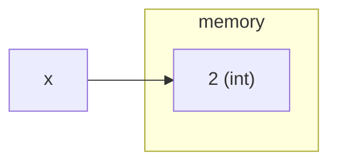
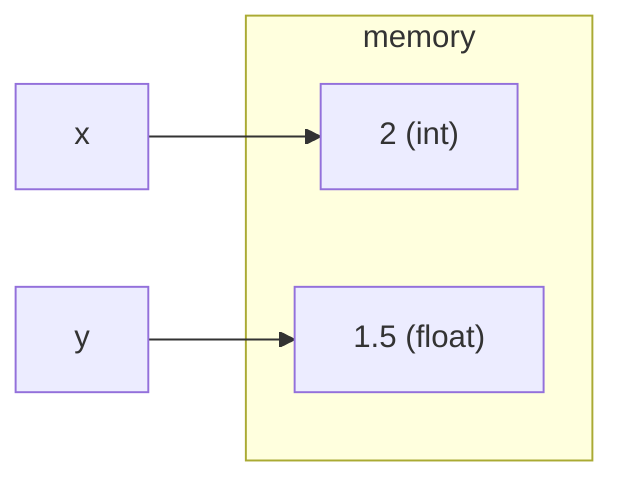
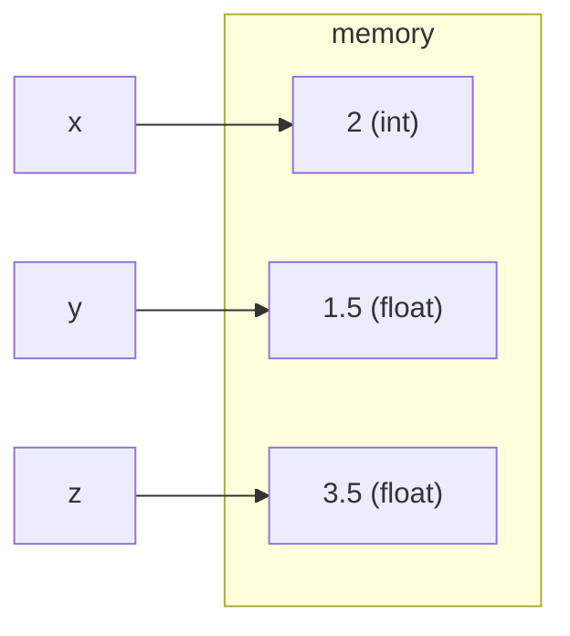
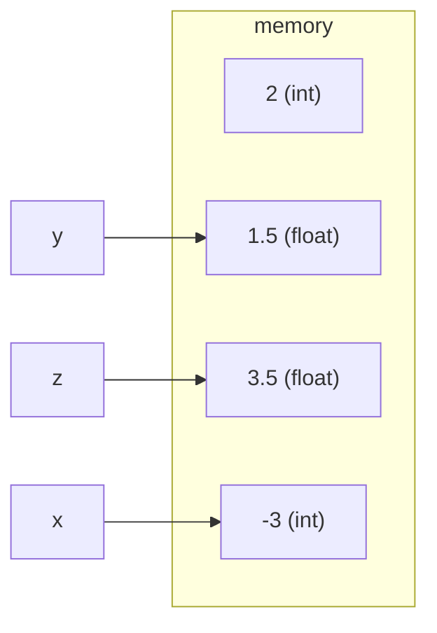

import Tabs from '@theme/Tabs';
import TabItem from '@theme/TabItem';

# Variables

## Assignment Workflow

Caveat that this is but one approach.
In the fullness of time,
everyone develops their own preferred workflows and ways of doing things.

But for the purposes of getting started, here is one workflow.

### Making a Folder

A lot of IDEs (Integrated Development Environments, fancy word for editors)
have a sort of built-in assumption that you are working on the project level,
where the project may have multiple files.

So often, the IDE is working in/opening the project folder.
And so we a need a folder on our computer to do work in.

Open your computer's file manage (e.g. Finder on Mac and File Explorer on Windows).

Navigate to where you want to make this new folder.
For example: There is usually a `Documents` folder on computers,
within that I might have/make a `school` folder,
and within that a `CICS110` folder,
and within that a `HW` folder.

Secondary click (right click on mouse, two-finger click on most trackpads, etc)
in the finder where you want to folder to be to bring up a menu.
Select either `New Folder` or `New > Folder` depending on your operating system.

Give the new folder a name, `1-variables`, for instance.
(You can secondary click on the folder to to bring up a menu that should have a `Rename` option,
if need be.)

### Opening a Folder

We need to open that folder in our editor to do stuff in it
(you can also make files directly, but I'm not demoing that approach specifically).

Launch VSCode.

Select `File > Open Folder`. This notation means,
click the `File` menu and then select `Open Folder` from the dropdown.

This menu is likely in the upper-left area of the application or of your entire screen
(depending on your operating system).

### Making a File

Select `File > New File ...`.

VSCode will ask for a name for the file, give it a name ending in `.py`,
e.g., `hello.py`. You need to specify that `.py` extension.

### Running a File

Finally, if you installed the extension packet from the
[VSCode installation guide](../../guides/vscode/installation#installing-python-extensions),
then there should be a play-button-like triangle in the upper-right of the
python file.

Simply click that button and VSCode will open a terminal and run the file for you.

<details>
<summary><b>Extra: Running the File via Terminal</b></summary>

You can deliberately open a terminal in VSCode via the menu
`Terminal > New Terminal`.

In the terminal, typing `python3` followed by a file name will run that file,
e.g., `python3 hello.py`.

</details>

## Parts of a Program

A program can be considered in terms of the information is is keeping track of,
and what it is doing with or based on that information.

The information, or *data*, or *object*s, correspond with the memory
part of out model of a computer running a program.

What it does with that, or the *logic*, corresponds to the instructions
part of out model of a computer running a program.

This lecture (like the last) focusses on the data/objects portion.

## Variables

Variables are a way to store and track information/objects.

Some people find the analogy of labeled boxes helpful,
where objects are put into boxes labeled by the variable name,
and can then be referenced by that variable name.

For instance:
```py live_py title=Variables
x = 2
y = 1.5
z = x + y
print("z:", z)
```

So what does each line here do?
* `x = 2` *assigns* the `int` `2` to the variable `x`.
* `y = 1.5` assigns the `float` `1.5` to the variable `y`.
* `z = x + y` first evaluate `x + y`, which is `2 + 1.5`,
which is `3.5` (a `float`); and then stores that in `z`.
* `print("z:", z)` prints `"z:"` and the value of `z`, which is `3.5`.

Importantly, variables can be overwritten.

Take the following:
```py live_py title=Variables_Overwrite
x = 2
y = 1.5
z = x + y
print("z:", z)
x = -3
print("x:", x)
print("z:", z)
```

So what does each line here do?
* The first 4 lines are the same as before.
  * `x` is the `int` `2`.
  * `x` is the `float` `1.5`.
  * `z` is the `float` `3.5`, which is printed.
* `x` is then set to the `int` `-3`.
* `x`, which is now `-3`, is printed (so `-3` is printed).
* `z`, which is still `3.5`, is printed (so `3.5` is printed).

### Legal Names

There are some important rules to remember about variable names:
* Names must be composed of only letters, numbers, and underscores `_`.
* Names may not **begin** with a number (must start with a letter or `_`).
* Names are case-sensitive. E.g., `Foo` and `foo` are different variables.

Examples of legal variables names:
* `Foo`
* `foo`
* `f00`
* `_foo`
* `foo_bar_42`

Examples of illegal variables names:
* `314_Foo`
* `foo!`

### Good Names

Just because a name is legal doesn't mean it is "good".
You would ideally like variables' names to articulate something about how they are used.

For example, say I have a program that takes in a number representing temperature in degrees
Fahrenheit and converts it to degrees Celsius.
I could reasonable name that input variable
`fahrenheit`, `Fahrenheit`, `degrees_F`, or even `F`.
If I named it `foo`, `potatoes_per_cubic_yoctogram`, or `a`, that would be
profoundly unhelpful to anyone subsequently viewing that code, my future self included.

The goal is to try to have that name make sense for the context it is in.

## Memory Diagrams

Trying to develop a sort of visual intuition for what is going in in your computer
can be incredibly powerful.
Many issues I have run into can be better understood with a good picture
involving rectangles and arrows.

Ultimately, you want to develop your own version of things that makes sense to you.
You can see the canonical representation of memory diagrams for this class in the slides.
I'll do something a little different here based on my understanding,
and the limits of what is more feasible with my knowledge of the website.

We can view memory as the computer's "scratch paper",
where it tracks all the objects/data. Variables are more like nicknames assigned to
objects to make it easier to reference or talk about them later.
We can walk through the earlier code example tracking the state of memory as we go.

<Tabs>
<TabItem value="x" label="x = 2" default>

The first line of code is `x = 2`.
This creates an object for the `int` `2`,
and then assigns `x` as a nickname to track that object.


</TabItem>
<TabItem value="y" label="y = 1.5" default>

The second line is much the same:
`y = 1.5` creates an object for the `float` `1.5`,
and assigns `y` as a nickname to track it.
`x` is still tracking its own thing.


</TabItem>
<TabItem value="z" label="z = x + y" default>

`z = x + y` has a little more going on.
First the right hand side is evaluated.
This involves looking up `x` and `y`, and then adding them together,
and then creating a new `float` object with value `3.5` for that sum.
Then the `z =` part has that new object set to be tracked/referenced
by the variable/nickname `z`.


</TabItem>
<TabItem value="x-again" label="x = -3" default>

The final line of code is `x = -3`.
This creates an object for the `int` `-3`,
and then assigns `x` as a nickname to track that object.
This means that `x` is no longer tracking that `int` `2` object,
it has fallen into obscurity.



<details>
<summary><b>Extra: Garbage Collection</b></summary>

Our computers don't have infinite memory/"scratch paper".
We want them to be able to identify these objects that are now obscure,
un-reference-able, and thus not going to be further used; and erase them to free up
more scratch paper.

We refer to these no-longer-to-be-used objects as *garbage*.
The act of identifying them and cleaning them up is *garbage collection*.
Technically, we don't erase the garbage (that takes time),
we just mark the region of memory they are in as safe to overwrite.

Garbage collection is not only outside the scope of this class,
but kind of outside the scope of your likely undergraduate studies
(if you work with the language C you will have to explicitly free up memory (in the heap) yourself,
but you won't ever worry about automatic garbage collector design).
But, since my advisor has helped write a [handbook on the matter](https://gchandbook.org),
I feel the need to shout out the concept;
and also to show that even with what little we have so far,
shadows of and reasons for deeper concepts can already be seen.

</details>

</TabItem>
</Tabs>

## The `input()` Function

The function stuff is going to be a bit fuzzy for now, we'll go into it more soon.
For a high-level understanding, it is best to look at the mathematical analogue.
Say we had the function $$f(x) = 2x^2 +1$$.
If I said $$y = f(5)$$, then since $$f(5)$$ would evaluate to $$2(5)^2 + 1 = 51$$,
we would have $$y = 51$$.

Similarly, in programming, functions take in *arguments*, evaluate to something
(called a *return*), and the results can be saved/captured in a variable.

The `input()` function is a bit weird even as function go, but is very important.
Its purpose is to get input from the *user*
(i.e. whoever is running the code, generally us in this case).

The `input()` function may optionally take in a string argument,
which is used as text to display when prompting the user.
We specify such a thing by putting it between the parentheses
(again, like a function in math).

The `input()` function evaluates to, or "outputs", or "returns",
whatever the user typed in, as a string.

Take for example this program (that perhaps looks familiar):
```py live_py title=Hello_You
your_name = input("Please enter your name: ")
print("Hello, " + your_name)
```

Go ahead and run it on the website. Then run it VSCode.
Notice the different ways you can be prompted for input.

The website pops up a dialogue box,
but the need to enter input into the terminal is less obvious:
```
$ python3 hello.py 
Please enter your name: Jared
Hello, Jared
```
I typed in that "Jared" and hit the return/enter key.

Now see what it looks like without specifying the prompt for the input function.
```py live_py title=Hello_You_Quite
your_name = input()
print("Hello, " + your_name)
```

The website still pops up a dialogue box,
but there is no indication (other than the terminal not prompting for another command)
of the need to enter text into the terminal:
```
$ python3 hello.py 
Jared
Hello, Jared
```

### Looking Back

We haven't explored functions yet,
but with just the idea of functions as black boxes taking arguments and giving returns,
we now have all the pieces to understand this program:
```py
your_name = input("Please enter your name: ")
print("Hello, " + your_name)
```

The first line is `your_name = input("Please enter your name: ")`:
* **`"Please enter your name: "`** is a string, we pass that the the function `input()`.
* **`input(`**`"Please enter your name: "`**`)`** then uses that string as a prompt to solicit input from the user,
and returns that input.
* **`your_name = `**`input("Please enter your name: ")` captures that returned input,
and stores it in the variable `your_name`.
* So if I entered `Jared` as the input, then `your_name` would hold `"Jared"`.

The second line is `print("Hello, " + your_name)`:
* Again, `your_name` contains the string `"Jared"` in this step-through example.
* The expression `"Hello, " + your_name` evaluates to `"Hello, Jared"`.
* **`print(`**`"Hello, " + your_name`**`)`** then prints `Hello, Jared` to the terminal.
