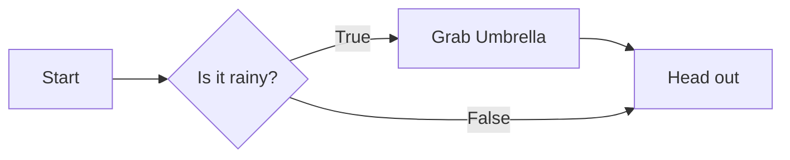
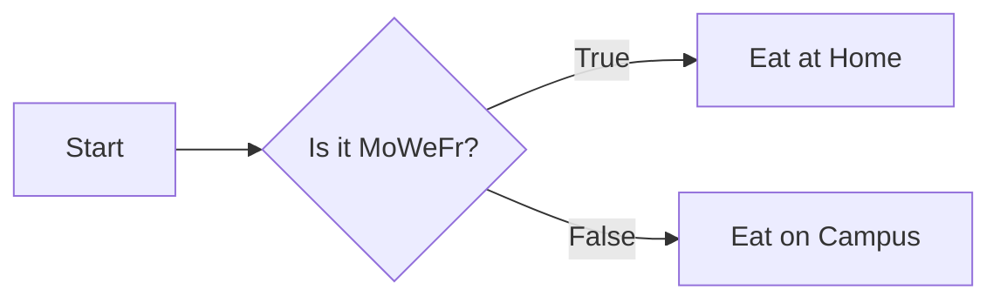
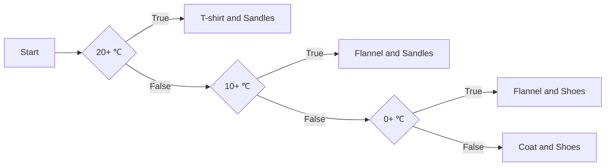
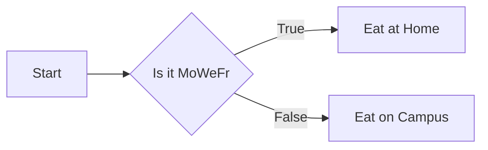
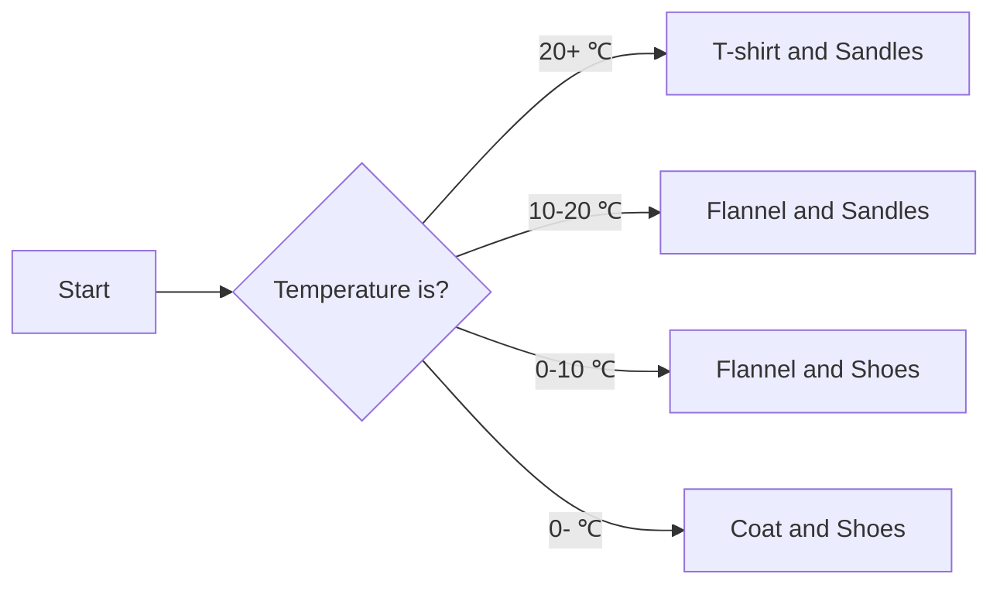
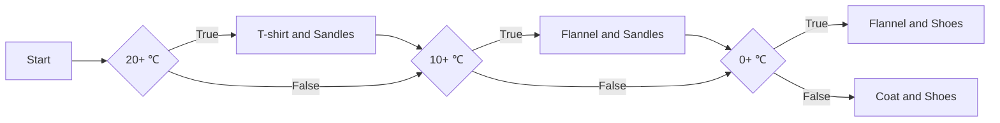

# Branching

## Making Choices

We as humans have plenty of cases where what we do depends on something.
For instance, if it is raining, I will grab my umbrella.

With boolean expressions we could represent the "it is raining" part of that.
The "I will grab my umbrella" part could be represented a bunch of ways in code
(such as adding `"umbrella"` to some list).
But that **"if"** part, having the code be dependent on the boolean,
that we can't do.

Time to change that.

<details>
<summary><b>Very Extra: Bootleg Branching</b></summary>

:::warning

This isn't a real point, this is just psychopathic coding.
This may do actively do damage to your psyche.
Although if you can make sense of it,
you are probably in a really solid place.

:::

Technically, we could bootleg branching by abusing short-circuiting.
By having the code we would like to be conditionally executed be in
right hand side of an `and` statement, it will only be executed if the
left hand side evaluates to `True`;
otherwise the short circuiting on `False` would prevent that code from being run.

```py live_py title=Bootleg_If
equipment = ["coat", "hat"]

weather = input("What is the weather today: ").lower()

is_rain = weather == "rain"
is_rain and equipment.append("umbrella")

print(f"Heading out with: {equipment}")
```

```py live_py title=Bootleg_If_Else
name = input("Please enter your name: ")
is_jared = name.lower() == "jared"

is_jared and print("Jared, you are sociopathic monster...")
not is_jared and print(f"Hello, {name}")
```

</details>

## Control Flow Diagrams

But before we get to new code syntax,
let's talk about a new tool for organising our thoughts on branching:
*control flow diagrams*.
As the name somewhat implies,
these are diagrams that show the flow of control/execution of code
(or of actions more broadly).

In a more strict form:
* They are composed of rectangles, diamonds, and arrows
* Rectangles represent actions (instructions in code)
* Diamonds represent choices/decisions (boolean conditions in code)
* There is a "Start" rectangle
* Each rectangle points to a "next" rectangle or diamond
* Diamonds have a "True" and "False" path coming out of them

For instance,
A control flow diagram for grabbing an umbrella before heading out if it is raining
might look like:



You can do totally different things in the True and False paths/branches.
For example, here's what my decision making for when I eat on campus vs in
my apartment looks like:



Sometimes decisions aren't really True vs False in the way we think about them.
For instance, what I wear when I go out depends on temperature ranges.
But these cases can still usually be reduced to a combination of True vs False checks:



Notice how the ranges are effectively 20+, 10-20, 0-10, 0-,
but each range is broken off into a case.
Moreover, by doing the cases in order, I can simplify how the cases are written
(e.g., I only need to check 10+ for the 10-20 range,
because that check only occurs in the <20 case).

## `if`

Let's turn this into code.

The most basic if statement is of the form:
```py
if condition:
  code

more_code
```

We have the keyword `if`, some boolean `condition` (variable/expression), a `:`,
and some **indented** *block* of `code` (can be multiple lines).
The `more_code` is not part of the if statement, just some context around it.

If `condition` is/evaluates to `True`,
then the flow of execution will enter the if-block and `code` will be executed,
then the flow of execution will exit the if-block and `more_code` will be executed.

If `condition` is/evaluates to `False`,
then the flow of execution will skip over the if-block and just `more_code` will be executed.

As an example, here is code for the "if it is raining, I will grab my umbrella" scenario:

```py live_py title=If
weather = input("What is the weather today: ")

equipment = ["coat", "hat"]

if weather == "rain": # if it is raining
  equipment.append("umbrella") # I will grab an umbrella

print(f"Heading out with: {equipment}")
```

Compare this to the control flow diagram from earlier:


The logical flow based on the decision is the same.

## `else`

Frequently, not only does `condition` being true mean we want to do something specific,
but we also want to do something else specific when it is false.

For example, my "where to eat" scenario. If it is Monday, Wednesday, or Friday,
I choose to eat in my apartment. Otherwise, I choose to eat on campus.
I'm doing distinct things in each case.

This could be done by doing an explicit
"if true do this" and "if false do this" type of thing:

```py live_py title=If_If_Not
day = input("What day is it: ").lower()

if day == "monday" or day == "wednesday" or day == "friday":
  print("Eating at Home")
if not (day == "monday" or day == "wednesday" or day == "friday"):
  print("Eating on Campus")
```

But that's gross and we have machinery for this. Introducing `else`:

```py
if condition:
  if_block_code
else:
  else_block_code

more_code
```

After the `if` block we have the keyword `else`, a `:`,
and some **indented** *block* of `code` (can be multiple lines).

If `condition` is/evaluates to `True`,
then the flow of execution will enter the if-block and `if_block_code` will be executed,
then the flow of execution will exit the if-block (ignoring the else-block)
and `more_code` will be executed.

If `condition` is/evaluates to `False`,
then the flow of execution will enter the else-block (ignoring the if-block)
and `else_block_code` will be executed,
then the flow of execution will exit the else-block and `more_code` will be executed.

Returning to the "where I eat" example:

```py live_py title=If_Else
day = input("What day is it: ").lower()

if day == "monday" or day == "wednesday" or day == "friday":
  print("Eating at Home")
else:
  print("Eating on Campus")
```

As before, the logical flow is the same as in the diagram:



## `elif`

What about that "what I wear" scenario:


Well, it can be pretty directly translated into if-else statements by nesting them
(notice how nesting requires an additional level of indentation for each if-else statement):

```py live_py title=If_Else_If_Else
temp = int(input("What is the temperature (in ℃): "))

if temp >= 20:
  print("Wearing t-shirt and sandles")
else:
  if temp >= 10:
    print("Wearing flannel shirt and sandles")
  else:
    if temp >= 0:
      print("Wearing flannel shirt and shoes")
    else:
      print("Wearing coat and shoes")
```

This nested if-else-if-else-if-else thing is pretty gross.
And wouldn't you know it, we have machinery for this.
Introducing `elif` (a portmanteau of "else" and "if"):

```py
if condition1:
  if_block_code
elif condition2:
  elif_block_code
.....             # OPTIONAL
else:             # OPTIONAL
  else_block_code # OPTIONAL

more_code
```

After the `if` block we have the keyword `elif`, another condition, a `:`,
and some **indented** *block* of `code` (can be multiple lines).

If `condition1` is/evaluates to `True`,
then the flow of execution will enter the if-block and `if_block_code` will be executed,
then the flow of execution will exit the if-block (ignoring all remaining elif and else blocks)
and `more_code` will be executed.

If `condition1` is/evaluates to `False`,
then the flow of execution will skip over the if-block and check `condition2`.
If `condition2` is/evaluates to `True`,
then the flow of execution will enter the elif-block and `elif_block_code` will be executed,
then the flow of execution will exit the elif-block (ignoring all remaining elif and else blocks)
and `more_code` will be executed.

You can chain as many `elif`s together as you like, and can end them in an `else`.
This lets us do the "what to wear" scenario more cleanly:

```py live_py title=If_Elif_Else
temp = int(input("What is the temperature (in ℃): "))

if temp >= 20:
  print("Wearing t-shirt and sandles")
elif temp >= 10:
  print("Wearing flannel shirt and sandles")
elif temp >= 0:
  print("Wearing flannel shirt and shoes")
else:
  print("Wearing coat and shoes")
```

While the logical flow does match the earlier control flow diagram,
the intuition is more akin to:



Finally, I want to emphasise the exclusive nature of the `elif`s.
If you have if-elif-...-else, only one block can possibly trigger.
And this lets you write later conditions under the assumption that prior conditions are false.
(Again, I only need to check `>= 10`, because that check only occurred when `>=20` was **false**,
giving me `>= 10` and `< 20`.)

If you were to have a bunch of pure ifs in a row, multiple if statements could trigger.
For instance, try this with a number of 20, you'll get three prints:

```py live_py title=If_If_Else
temp = int(input("What is the temperature (in ℃): "))

if temp >= 20:
  print("Wearing t-shirt and sandles")
if temp >= 10:
  print("Wearing flannel shirt and sandles")
if temp >= 0:
  print("Wearing flannel shirt and shoes")
else:
  print("Wearing coat and shoes")
```

And in fact, this is the equivalent control flow diagram:



Notice the path that hits multiple choice-of-attire rectangles.