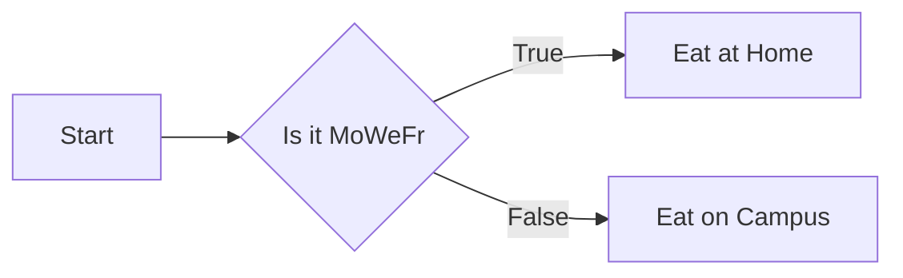
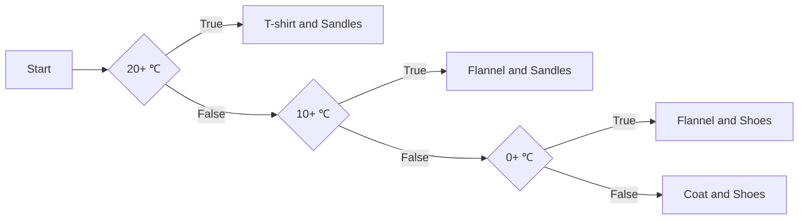
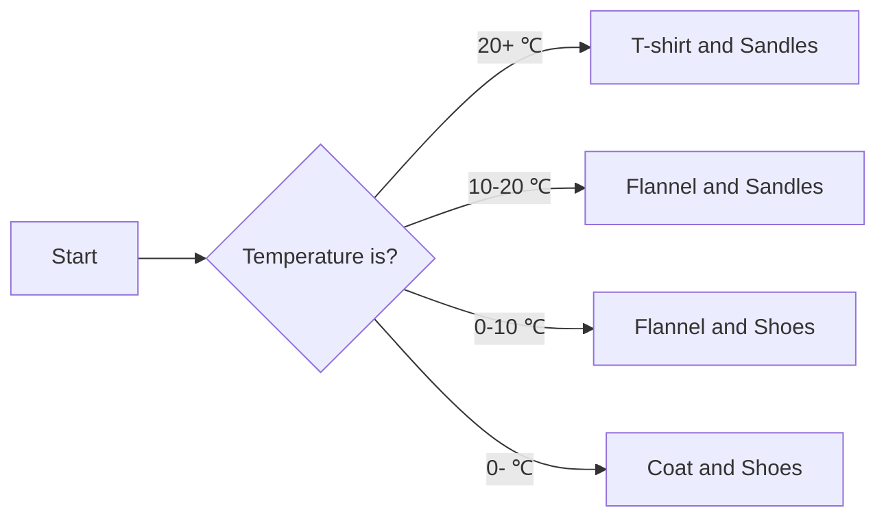
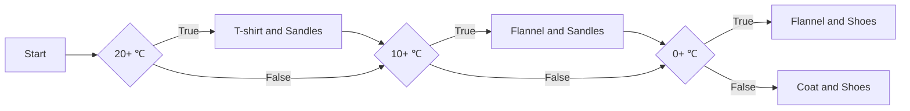

# Branching

## Assignment Updates

Stuff due this week:
* (Presumably) Participation 4 **Due Thursday 3/9**
* (Presumably) Quiz 5: **Due Thursday 3/9**
* HW 3: **Due Friday 3/10**
* Lab 5: **Due Friday 3/10**

Stuff due next week:
* Nothing! Enjoy the break!

Finally, HW4 will **not** be due the week of 3/20 to 3/24.
We want to treat the break (3/11 to 3/19) as null time.

## Control Flow Diagrams





## `if`

```py live_py title=If
name = input("Please enter your name: ")

if name == "": # if no name given
  name = "[REDACTED]" # set it to some default

print(f"Hello, {name}")
```

## `else`

```py live_py title=If_Else
day = input("What day is it: ").lower()
if day == "monday" or day == "wednesday" or day == "friday":
  print("Eating at Home")
else:
  print("Eating on Campus")
```


## `elif`

```py live_py title=If_Else_If_Else
temp = int(input("What is the temperature (in ℃): "))

if temp >= 20:
  print("Wearing t-shirt and sandles")
else:
  if temp >= 10:
    print("Wearing flannel shirt and sandles")
  else:
    if temp >= 0:
      print("Wearing flannel shirt and shoes")
    else:
      print("Wearing coat and shoes")
```


```py live_py title=If_Elif_Else
temp = int(input("What is the temperature (in ℃): "))

if temp >= 20:
  print("Wearing t-shirt and sandles")
elif temp >= 10:
  print("Wearing flannel shirt and sandles")
elif temp >= 0:
  print("Wearing flannel shirt and shoes")
else:
  print("Wearing coat and shoes")
```



```py live_py title=If_If_Else
temp = int(input("What is the temperature (in ℃): "))

if temp >= 20:
  print("Wearing t-shirt and sandles")
if temp >= 10:
  print("Wearing flannel shirt and sandles")
if temp >= 0:
  print("Wearing flannel shirt and shoes")
else:
  print("Wearing coat and shoes")
```

