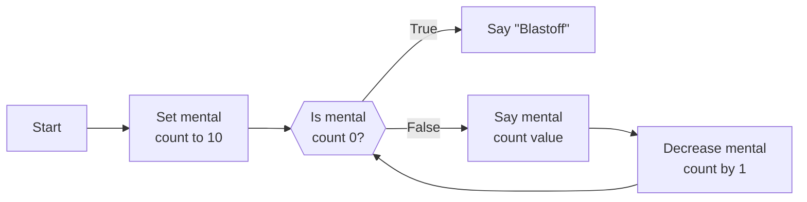
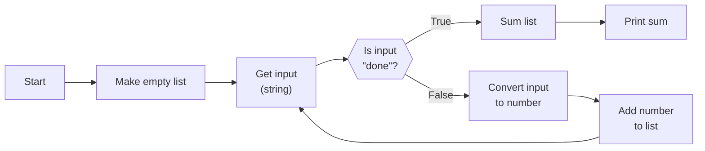
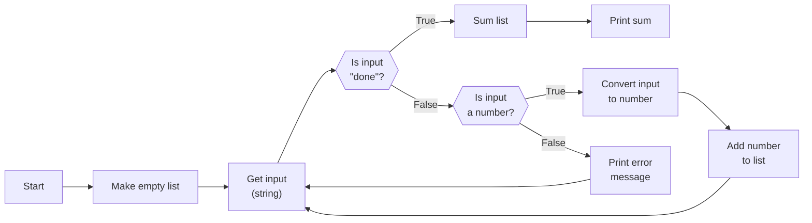

# Looping

## Repeating Actions

## Control Flow Diagrams



## While

```py live_py title=While
count = 10
while count != 0:
  print(f"{count}...")
  count -= 1 # equivalent to count = count - 1
print("Blastoff!")
```

## Break



### "Issue": Shifting Off-Sync Loops

### "Solution": Breaking Off-Sync Loops

```py live_py title=Break
nums = []
while True: # make a loop without a termination condition
  inp = input("Please enter a number or 'done'")
  if inp.lower() == "done":
    break
  num = int(inp)
  nums.append(num)
total = sum(nums)
print(f"Sum: {total}")
```

## Continue



```py live_py title=Continue
# Eh, probably good enough.
#   not empty and (all numbers or (negative sign and all number thereafter))
def is_convertable_to_int(s):
  return s != "" and (s.isnumeric() or (s[0] == "-" and s[1:].isnumeric()))

nums = []
while True: # make a loop without a termination condition
  inp = input("Please enter a number or 'done'")
  if inp.lower() == "done":
    break
  if not is_convertable_to_int(inp):
    print(f"'{inp}' is not a number.")
    continue
  num = int(inp)
  nums.append(num)
total = sum(nums)
print(f"Sum of {nums}: {total}")
```
