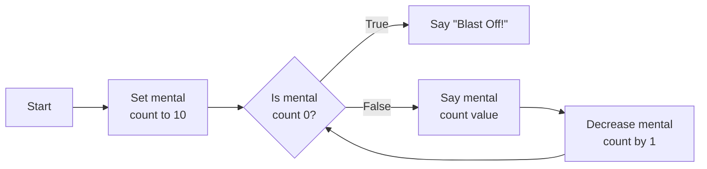
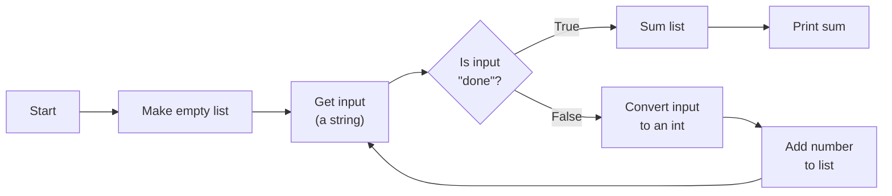
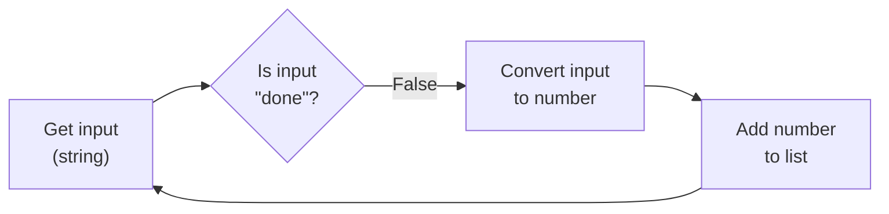
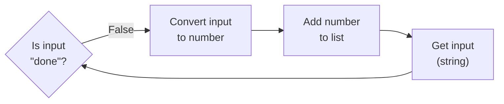
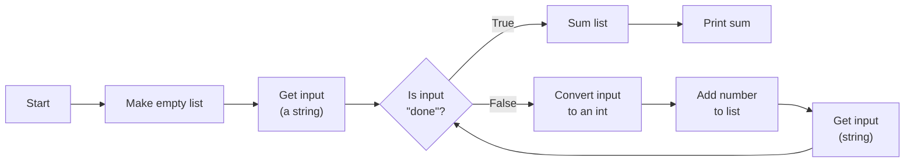
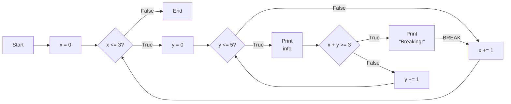
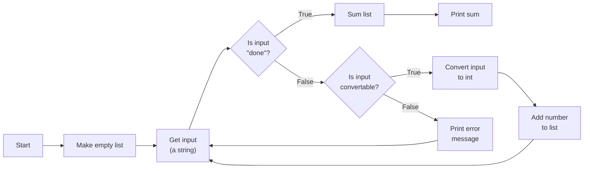
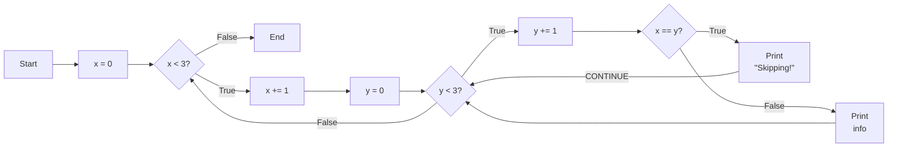

# Looping (While)

## Repeating Actions

There are times where we would like to repeat an action,
or variations of an action, multiple times.

Imagine, for instance, counting down until a rocket blasts off:
"10 ... 9 ... ... 1 ... Blast Off!".
There is a sort of mental counter, starting at 10,
that we repeatedly say out loud and then decrease, until it is 0,
at which point we say "Blast off!".

We could certainly represent this in code for fixed `10` with brute force,
but if we wanted the countdown to start from some arbitrary number, we'd be out of luck.
We lack the ability to do any sort of "conditional repetition".

So lets fix that, and in the process,
acquire that last bit of core programming machinery we are missing.

## Control Flow Diagrams

But first, what does that repetition look like in terms of our control flow diagrams?

The countdown example can be represented as below:



That's right, we totally can have arrows that point to previous steps.
And when that happens, we get a *loop*.

We can even read that loop as saying
"*while* count is not 0, say (print) count value and decrease count".

## While

Which brings us to the *while loop*.

The most basic while loop statement is of the form:
```py
while condition:
  code

more_code
```

We have the keyword `while`, some boolean `condition` (variable/expression), a `:`,
and some **indented** block of `code` (can be multiple lines).
The `more_code` is not part of the while loop, just some context around it.

If `condition` is/evaluates to `True`,
then the flow of execution will enter the while-block and `code` will be executed;
then the `condition` will be checked again, and if it again is/evaluates to `True`,
`code` will be executed again. This will repeat until `condition` is/evaluates to `False`.

If `condition` is/evaluates to `False`,
either the first time it is checked or sometime after `code` was executed,
then the flow of execution will skip over the while-block and `more_code` will be executed.

As an example, here is code for the countdown scenario:

```py live_py title=While
count = 10
while count != 0:
  print(f"{count}...")
  count -= 1 # equivalent to count = count - 1
print("Blastoff!")
```

Compare this to the control flow diagram from earlier:


The logical flow based on the decision and the flow of the looping is the same.

## Break

There is still a snag.
You can see a fairly clear correspondence between while loops and control flow diagrams
when the loop starts on the diamond:
the diamond becomes the condition for the while loop,
and the commands on the loop become the code block.

But what if the loop doesn't start on the condition?
Consider reading in a bunch of numbers until you see the word `"done"`,
and then adding all the previous numbers together.
A control flow diagram for that might look like:



For while loops, the `condition` which determines the looping needs to be the first thing.
So this can not be directly translated.

### Shifting the Loop

We can tackle this with our existing machinery.
First consider the looping part in isolation:



As just a pure loop,
we can see that control-flow wise this is equivalent to the same loop with the starting point shifted:



But putting that back into the original context is a little trickier.
The key difference in context is that there is an original "Get input".
But after that, the core loop is the same.

We can consider that initial "get input" as a one-off (unrolling a partial loop),
and have our core loop start with the diamond. That gets us the following:



And that control flow diagram can be fairly directly translated into code:

```py live_py title=While_Offset
nums = []
inp = input("Please enter a number or 'done'")
while inp.lower() != "done":
  num = int(inp)
  nums.append(num)
  inp = input("Please enter a number or 'done'")
total = sum(nums)
print(f"Sum of {nums}: {total}")
```

### Breaking Out of the Loop

(You can probably imagine what I'm about to say.)
That's kind of gross, and we have machinery for this!
Alright, it's not super gross,
but writing the same line of code for the same task in multiple separate locations
is kind of a "code smell". It is a sign that we can probably do better.

So let's go back to the original diagram:


It turns out that there is a special command, `break`,
that breaks us out of whatever loop we are in. So if we see `"done"`, we can just break.

But what is the loop condition? What's interesting is that the "is done" check that
controls the loop would actually now be in an if statement inside the loop
indicating that it is time to break.

If we are considering the loop to start at "get input",
then we never have a condition there that could end to loop.
In other words, from the while loop's perspective, we **always loop** (maybe trigging a break inside).

And so we get this:

```py live_py title=Break
nums = []
while True: # make an "infinite" loop
  inp = input("Please enter a number or 'done'")
  if inp.lower() == "done":
    break
  num = int(inp)
  nums.append(num)
total = sum(nums)
print(f"Sum of {nums}: {total}")
```

### Nesting

**Note: `break` only breaks you out of the most immediate loop that you are in.**

If we use `break` in a loop within a loop, we only break out of the inner loop.
Consider the example below:

```py live_py title=Break_Nested
x = 0
while x <= 3:
  y = 0
  while y <= 5:
    print(f"(x, y, x + y) = ({x}, {y}, {x + y})")
    if x + y >= 3:
      print("Breaking!")
      break
    y += 1 # y = y + 1
  x += 1 # x = x + 1
```

If you run this you will see that break triggers multiple times,
indicating that it isn't breaking control flow out of both loops, just the inner one.

If it helps, a control flow diagram for this code could be:


## Continue

There is one more special command for loops, `continue`.
`continue` has you skip the rest of the commands in the loop
and immediately begin the next iteration.
This can be useful if a run of the loop is borked and you need to start over,
such as if an illegal input is encountered.

Let's add exactly that to the summation example,
making it so that if the the input would not become a number,
we scold the user and go right back to asking for a number.
Here's the new control flow diagram:



And here's the updated code that implements that control flow diagram using `continue`:

```py live_py title=Continue
# Eh, probably good enough.
#   not empty and (all numbers or (negative sign and all number thereafter))
def is_convertable_to_int(s):
  return s != "" and (s.isnumeric() or (s[0] == "-" and s[1:].isnumeric()))

nums = []
while True: # make a loop without a termination condition
  inp = input("Please enter a number or 'done'")
  if inp.lower() == "done":
    break
  if not is_convertable_to_int(inp):
    print(f"'{inp}' is not a number.")
    continue
  num = int(inp)
  nums.append(num)
total = sum(nums)
print(f"Sum of {nums}: {total}")
```

We could have equivalently used an if-else,
checking for the affirmative instead of the negative even,
as a reminder that there are almost always multiple ways to do things:

```
  if is_convertable_to_int(inp):
    num = int(inp)
    nums.append(num)
  else:
    print(f"'{inp}' is not a number.")
```

### Nesting

And yes, for nested loops, `continue` (like `break`)
only starts the next iteration of the inner-most loop.

```py live_py title=Continue_Nested
x = 0
while x < 3:
  x += 1 # x ranges from 1 to 3
  y = 0
  while y < 3:
    y += 1 # y ranges from 1 to 3
    if x == y:
      print("Skipping!")
      continue
    print(f"(x, y) = ({x}, {y})")
```

If you run this you will see that continue does not reset `y` to `0`,
so it is only moving to the next iteration of the inner loop.

If it helps, a control flow diagram for this code could be:

