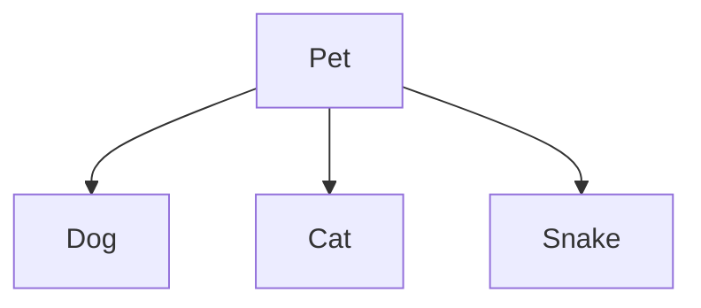
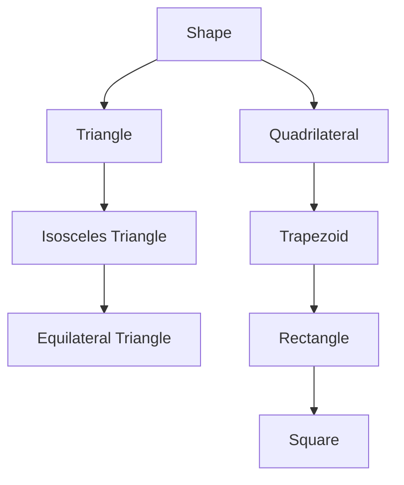

# Inheritance and Dunder Methods

There are a a few lingering topics about classes to cover.

First, the notion of inheritance:
where we can have a class that is an expansion/sub-class of another class.

Second, some more fancy double-underscore (or *dunder*) methods,
which allow us to define string conversion and to specify operator behaviour.

## Inheritance

Earlier, we made a `Dog` class for demonstration purposes.
Now imagine that we have a `Cat` class, and a `Snake` class.

All of these are different in some ways, and do slightly different things.
For our demo-ing purposes:
* A dog will `bark()`
* A cat will `meow()`
* A snake will `hiss()`

But there are also some similarities.
For our demo-ing purposes, we will consider all of these as pets, moreover:
* They will all have names
* They will all be able to `sleep()`

And so the idea is that we can have a `Pet` class, that does this shared stuff:
initialising with a name, and `sleep()`ing.
And we can then have `Dog`, `Cat`, and `Snake` classes that *extend* `Pet`.
We would also say these are *sub-classes* of `Pet`, or that `Pet` is the *super-class*
or *parent class* of these three.



These three classes will *inherit* `Pet`'s fields and methods,
and can establish their own on top of that.
And later, we will have them possibly *override* `Pet`'s methods.

Another example of a potential inheritance relationship,
that you may encounter in the homework:



### Sub-Classing

Alrighty, so how do we do this in code?
Well, we say that `Dog` is a sub-class of `Pet`
by declaring it with `class Dog(Pet):`, instead of `class Dog:`.

That's it, check it out:

```py live_py title=Inherit_Subclass
class Pet:
  def __init__(self, name):
    self.name = name

  def sleep(self):
    print(f"Zzzzz ({self.name} is sleeping)")

class Dog(Pet):
  def bark(self):
    print("Woof!")

inu = Dog("Inu")
print(f"Is Inu a Pet? {isinstance(inu, Pet)}") # True
print(f"Is Inu a Dog? {isinstance(inu, Dog)}") # True

print()

print(f"{inu.name}:")
inu.bark()
inu.sleep()
```

There is a class `Pet` with an initialised name and `sleep()` method;
and a sub-class thereof named `Dog`, with a `bark()` method.
Dog inherits from `Pet`, including the initialiser method, so is initialised with a name.
An instance of `Dog` is also technically an instance of `Pet`,
and so can `sleep()` (as `Pet`s can) and `bark()` (as `Dog`s can).

Another example, but with two subclasses of `Pet`:

```py live_py title=Inherit_Subclasses
class Pet:
  def __init__(self, name):
    self.name = name

  def sleep(self):
    print(f"Zzzzz ({self.name} is sleeping)")

class Cat(Pet):
  def meow(self):
    print("Meow!")

class Snake(Pet):
  def hiss(self):
    print("Hiss!")

neko = Cat("Neko")
hebi = Snake("Hebi")

print(f"{neko.name}:")
neko.meow()
neko.sleep()

print()

print(f"{hebi.name}:")
hebi.hiss()
hebi.sleep()
```

### Overriding Methods

Sometimes, we do want a sub-class to behave differently from it's parent.
Maybe we want it to expand on the functionality of the parent, or maybe we want to
override it all together.

Let's say we go a bit nuts in our `Pet` example, and get a pet `Jellyfish`.
Now, jellyfish are not exactly know for "sleeping", per se
(it sort of becomes a semantic quibble about what one means by "sleep").

So let's have the `Jellyfish`'s `sleep()` method be different.
How do we do this? By defining it like normal!
The methods we inherit from the parent class are defaults,
but we can override them by specifying something else.

```py live_py title=Override
class Pet:
  def __init__(self, name):
    self.name = name

  def sleep(self):
    print(f"Zzzzz ({self.name} is sleeping)")

class Jellyfish(Pet):
  def sleep(self):
    print(f"{self.name} is just floating")

umi = Jellyfish("Umi")
umi.sleep()
```

And so notice how when we have an instance of `Jellyfish` `sleep()`,
it is `Jellyfish`'s `sleep()`, not `Pet`'s `sleep()`.

### `super()`

(This is going to be a little in the realms of "just trust me" on the syntax.)

What if, within a sub-class,
we want to expand upon and even use a parent's version of a method.
For instance, say we want to change our dog initialiser to take in a `name` **and**
a `breed`.
We don't want to re-do the work that the `Pet` initialiser does to set the name,
in fact, we want to do exactly that and **then** set the `breed`.

There is a way to make use of `Pet's` `__init__()` within `Dog`'s `__init__()`,
but it's a little weird. There is this function called `super()`.
An argument-less call to `super()` will secretly grab `self`,
and effectively returns `self` as an instance of the super-class.

So let's see some code, and unpack what it does.

```py live_py title=Super_Pet
class Pet:
  def __init__(self, name):
    self.name = name

  def sleep(self):
    print(f"Zzzzz ({self.name} is sleeping)")

class Dog(Pet):
  def __init__(self, name, breed):
    # We use super() to consider self as a Pet here
    super().__init__(name)
    self.breed = breed

  def print_info(self):
    print(f"{self.name} is a {self.breed}.")

spot = Dog("Spot", "Golden Retriever")
inu = Dog("Inu", "Shiba Inu")
spot.print_info()
inu.print_info()
```

So, let's look at the call from the line `spot = Dog("Spot", "Golden Retriever")`.
This runs `Dog`'s `__init__()` with `self` as `spot`-to-be,
`name` as `"Spot"`, and `breed` as `"Golden Retriever"`.

`super()` will return `self` (`spot`-to-be), but as a `Pet`.
So `super().__init__(name)` will call `Pet`'s `__init__()` with
`self` as `spot`-to-be-as-a-`Pet` and `name` as `"Spot"`, which
sets the `name` field.

We then return from that call and set the `breed` field,
finishing the initialisation.

I highly recommend stepping through this example on
[pythontutor](https://pythontutor.com) to help visualise what is happening.

Below is another example of the overriding in a way that invokes
the super-version of the method.

```py live_py title=Super_Shape
class Trapezoid:
  def __init__(self, top, bottom, sides):
    self.top = top
    self.bottom = bottom
    self.sides = sides

  def perimeter(self):
    return self.top + self.bottom + 2*self.sides

class Rectangle(Trapezoid):
  def __init__(self, width, height):
    super().__init__(width, width, height)

trap = Trapezoid(2, 3, 1)
print(f"Trapezoid perimeter: {trap.perimeter()}")

rect = Rectangle(2, 1)
print(f"Rectangle perimeter: {rect.perimeter()}")
```

### Example: Board Games

When demonstrating new concepts for the first time we tend to use smaller examples,
but they may be not be reflective of something you might actually find yourself doing.

This example is hopefully more plausible.
The idea is that we want to make a bunch of different games
that are played on/with some sort of 2D grid/board.

So we have a parent class `GridGame` to capture some shared behaviour:
* Having a board field
* Initialising a board of a specified size
* Updating the board
* Printing the board

We then extend it to make a `TicTacToeGame`
(which just needs to invoke the super-constructor to make it a 3 by 3 board).

We then extend it to make a `Connect4Game`, which overloads the
constructor and the `update_board()` method,
so that updating only needs to take in a column ("gravity" determines the row).

```py live_py title=Board_Games
class GridGame:
  def __init__(self, height, width):
    self.board = [[" " for col in range(width)] for row in range(height)]
    self.width = width
    self.height = height

  def update_board(self, row, col, player):
    self.board[row][col] = player

  # Just trust me (I'm making it dense to not eat up too much space)
  def print_board(self):
    sep = "---".join(list((self.width+1)*"+"))
    rows = ["| "+" | ".join(row)+" |" for row in self.board]
    for i in range(2*self.height+1):
      print(rows[(i-1)//2] if i % 2 == 1 else sep)

class TicTacToeGame(GridGame):
  def __init__(self):
    super().__init__(3, 3)

class Connect4Game(GridGame):
  def __init__(self):
    super().__init__(6, 7)

  def update_board(self, col ,player):
    for row in range(self.height-1,-1,-1):
      if self.board[row][col] == " ":
        super().update_board(row, col, player)
        return

print("Generic 3 row, 2 column game:")
game = GridGame(3, 2)
game.update_board(1, 1, "A")
game.print_board()

print()
print("Tic-Tac-Toe game:")
ttt = TicTacToeGame()
ttt.update_board(1, 1, "X")
ttt.print_board()

print()
print("Connect 4 game:")
con4 = Connect4Game()
con4.update_board(3, "X")
con4.update_board(3, "O")
con4.update_board(4, "X")
con4.print_board()
```

## Dunder Methods

There are a lot of special method names with their own significance and effects,
like `__init__()`. Most of these names start and end with "**d**ouble **under**scores"
and have thus earned the moniker "dunder" methods.

We will look at the dunder method that governs string conversion,
and the dunder methods that govern operators (like `+`).

### String Conversion

By default, converting a class to a string (and thus printing)
produces a string of the form `"<CLASS_NAME object at MEMORY_ADDRESS>"`.

Here is a `Pair` class, and how it prints by default
(the web-python seems to forgo the memory address part, but you can see the idea):

```py live_py title=Pair_Default
class Pair:
  def __init__(self, x, y):
    self.x = x
    self.y = y

point = Pair(2, 5)
print(f"string conv  : {str(point)}")
print(f"direct print : {point}")
```

This is not especially informative to us.

We can override this default behaviour by implementing the `__str__()` method.
This method only takes in `self`, and returns the desired string representation.

Here is how we might make a `Pair` of `x` and `y` print as `(x, y)`:

```py live_py title=Pair_Pretty
class Pair:
  def __init__(self, x, y):
    self.x = x
    self.y = y

  def __str__(self):
    return f"({self.x}, {self.y})"

point = Pair(2, 5)
print(f"string conv  : {str(point)}")
print(f"direct print : {point}")
```

### Operators

Finally, consider how `+` on numbers returns a new number based on addition,
yet `+` on strings returns a new string based on concatenation.
We refer to the this "doing different things based on different types of inputs"
as *overloading*.

And we can overload `+` to do something on any of our classes by implementing the
`__add__()` method.
This method takes two arguments, `self` and some `other`.
Importantly, `self` represents the operand on the **left** and
`other` represents the operand on the **right**
(this will matter for subtraction later).
The return must be a **new** `Pair`, representing the sum "`self + other`"
(akin to how `"Hello" + "World"` would return a new string `"HelloWorld"`).

So here is how we could overload `+` on `Pair`s to do point-wise addition:

```py live_py title=Pair_Add
class Pair:
  def __init__(self, x, y):
    self.x = x
    self.y = y

  def __add__(self, other):
    return Pair(self.x + other.x, self.y + other.y)

  def __str__(self):
    return f"({self.x}, {self.y})"

a = Pair(2, 5)
b = Pair(-1, 3)
print(f"  a : {a}")
print(f"  b : {b}")
print(f"a+b : {a+b}")
```

There are plenty of dunder methods for operators, here are just a few:
* `__neg__(self)`, for negation, i.e., `-a`
* `__add__(self, other)`, for addition, i.e., `a + b`
* `__sub__(self, other)`, for subtraction, i.e., `a - b`
* `__mul__(self, other)`, for multiplication, i.e., `a * b`
* `__truediv__(self, other)`, for division, i.e., `a / b`

And here is code for all of those implemented as point-wise operations on `Pair`s:

```py live_py title=Pair_Ops
class Pair:
  def __init__(self, x, y):
    self.x = x
    self.y = y

  def __neg__(self):
    return Pair(-self.x, -self.y)

  def __add__(self, other):
    return Pair(self.x + other.x, self.y + other.y)

  def __sub__(self, other):
    return Pair(self.x - other.x, self.y - other.y)

  def __mul__(self, other):
    return Pair(self.x * other.x, self.y * other.y)

  def __truediv__(self, other):
    return Pair(self.x / other.x, self.y / other.y)

  def __str__(self):
    return f"({self.x}, {self.y})"

a = Pair(2, 5)
b = Pair(-1, 3)
print("*** Base ***")
print(f"  a : {a}")
print(f"  b : {b}")
print("*** Neg ***")
print(f" -a : {-a}")
print(f" -b : {-b}")
print("*** Add ***")
print(f"a+b : {a+b}")
print(f"b+a : {b+a}")
print("*** Sub ***")
print(f"a-b : {a-b}")
print(f"b-a : {b-a}")
print("*** Mul ***")
print(f"a*b : {a*b}")
print(f"b*a : {b*a}")
print("*** Div ***")
print(f"a/b : {a/b}")
print(f"b/a : {b/a}")
```

### More Reading

When I was bringing myself up to speed on these dunder methods,
I found the following references useful (some for learning, some for referencing):
* [A tutorial on dunder methods](https://realpython.com/operator-function-overloading/)
* [General python documentation](https://docs.python.org/3/reference/datamodel.html#special-method-names)
* [List of numeric dunder methods in python documentation](https://docs.python.org/3/reference/datamodel.html#emulating-numeric-types)
